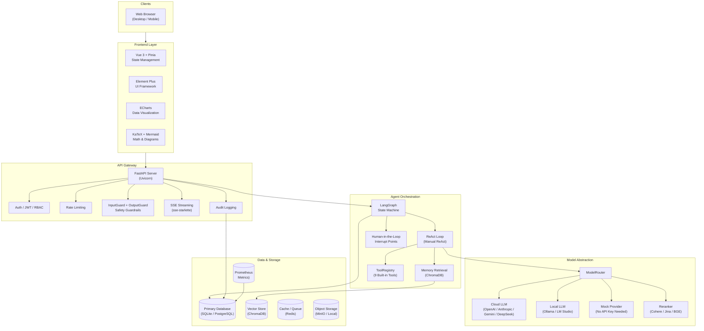
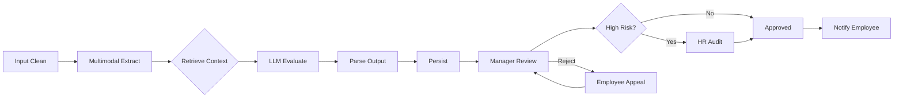
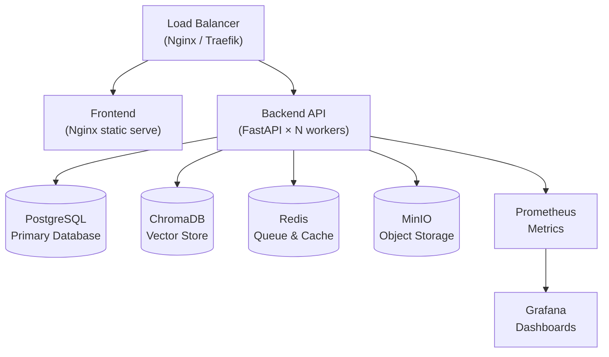
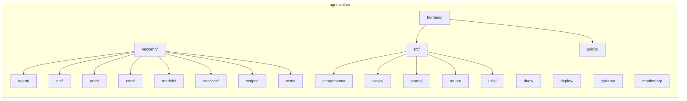

<p align="center">
  
</p>

<h1 align="center">AgentValue</h1>

<p align="center">
  <strong>AI 駆動型従業員価値定量化・成長プラットフォーム</strong><br/>
  会話型 AI · エージェントツール · 自動パフォーマンス評価 · 3視点評価システム
</p>

<p align="center">
  <a href="LICENSE"></a>
  
  
  
  
  
  
  <a href="CHANGELOG.md"></a>
  <a href="https://gitcode.com/badhope/agentvalue/issues"></a>
</p>

<p align="center">
  <a href="#-features">機能</a> •
  <a href="#-architecture">アーキテクチャ</a> •
  <a href="#-quick-start">クイックスタート</a> •
  <a href="#-configuration">設定</a> •
  <a href="#-usage-guide">使い方</a> •
  <a href="#-deployment">デプロイ</a> •
  <a href="#-multi-language">🌐 中文</a> •
  <a href="#-multi-language">🇯🇵 日本語</a>
</p>

---

## ✨ 機能

### 🤖 AI チャット

| 機能 | 説明 |
|---|---|
| **ストリーミング応答** | SSE によるトークン単位の逐次出力、中断サポート |
| **ツールコール表示** | 折りたたみ可能な I/O、JSON 整形、ステータスアイコン |
| **思考プロセス** | 折りたたみ可能な `reasoning_content`（DeepSeek / Gemini / Claude） |
| **メッセージ操作** | コードブロック / メッセージ全体のコピー、ユーザーメッセージ編集、再生成 |
| **セッション管理** | 自動タイトル生成、リネーム、検索、Markdown エクスポート |
| **数式レンダリング** | KaTeX インライン `$...$` およびブロック `$$...$$` |
| **図表レンダリング** | Mermaid フローチャート & シーケンス図、遅延読み込み対応 |
| **ファイルアップロード** | 複数ファイル添付、10 MB 制限 |
| **モデル切り替え** | 8 以上のモデルをドロップダウンで選択 |
| **フィードバック** | いいね / よくない、永続化対応 |

### 🛠 エージェントツールシステム

| ツール | 説明 | セキュリティ |
|---|---|---|
| `bash` | シェルコマンド実行 | 30 秒タイムアウト、5000 文字で切り捨て |
| `read_file` | ファイル内容読み取り | 5000 文字で切り捨て |
| `write_file` | ファイル書き込み | 親ディレクトリを自動作成 |
| `list_directory` | ディレクトリ内容一覧 | — |
| `web_fetch` | Web ページ取得・解析 | HTML からテキストへ変換、切り捨て |
| `calculator` | 算術演算・数式評価 | — |
| `get_current_datetime` | 現在日時取得 | — |
| `get_employee_history` | 過去評価の照会 | ビジネスツール |
| `query_company_kb` | 企業知識ベースの照会 | ビジネスツール |

すべてのツールは `ToolRegistry` で管理されます。`enabled_tools` により環境ごとに有効/無効を設定できます。

### 📊 従業員価値評価

中核となる差別化要素 — マルチパースペクティブ AI 評価システム：

| 視点 | 対象者 | 目的 |
|---|---|---|
| **従業員ビュー** | 従業員本人 | 建設的な成長フィードバック、強みと改善点 |
| **マネージャービュー** | マネージャー / HR | 人材診断、ROI 分析、チーム構成提案 |
| **監査ビュー** | コンプライアンス / 監査 | すべての結論に根拠を紐付け、完全トレーサブル |

すべての評価は、有効化前に **人間による承認プロセス** を必須とします。AI は構造化された評価を生成し、人間が最終判断を下します。

### 👥 ロールベースダッシュボード

| ポータル | ルート | ロール | 主な機能 |
|---|---|---|---|
| 従業員 | `/employee` | `employee` | 成長ダッシュボード、レーダーチャート、日次入力、履歴、フィードバック、成長パス |
| マネージャー | `/manager` | `manager`, `admin` | チーム価値ランキング、リスク分析、承認待ち、ROI 9 ボックス |
| HR | `/hr` | `hr`, `admin` | レビューキュー、監査詳細、申し立て、異議追跡 |
| 管理者 | `/admin` | `admin` | モデル管理、LLM 設定、プロバイダー設定、プロンプトツール、監査ログ、セキュリティ、請求 |

### ⚙️ 管理コンソール（40 以上の管理ページ）

| カテゴリ | ページ |
|---|---|
| **モデル & LLM** | モデル管理、LLM 設定、モデルプロバイダー、プロンプトプレイグラウンド、プロンプト管理、モデルフォールバック |
| **エージェント & ツール** | エージェントプリセット、スキル、カスタムツール、ワークフローオーケストレーション、マルチエージェント |
| **可観測性** | トレースビューアー、トークンメトリクス、API ヘルス、監査ログ、デバッグトレース |
| **評価** | タレントマトリックス、LLM ジャッジ、RAG 評価、人手によるアノテーション、データセット管理 |
| **セキュリティ & コンプライアンス** | セキュリティガバナンス、機密ワード、SSO 設定、クォータ & 予算、請求 |
| **コンテンツ & ナレッジ** | 知識ベース、ドキュメント解析、NL2SQL、複合検索 |
| **運用** | フィーチャーフラグ、アラート管理、スケジュールタスク、リリース運用、モデル運用 |

> `*` が付いたページはバックエンド API とデータモデルが実装済みですが、管理 UI は構築中です。その他のルートはすべて完全に機能するフロントエンドページを備えています。

---

## 🏗 アーキテクチャ



### 技術スタック

| レイヤー | 技術 |
|---|---|
| **フロントエンド** | Vue 3 (JavaScript) · Vite · Element Plus · ECharts · Vue Flow · KaTeX · Mermaid |
| **バックエンド** | Python 3.11+ · FastAPI · SQLAlchemy · Alembic |
| **エージェントフレームワーク** | LangGraph（スーパーバイザーマルチエージェント + ReAct ループ + SSE ストリーミング） |
| **LLM プロバイダー** | OpenAI / Anthropic Claude / Google Gemini / DeepSeek / Qwen / Ollama（暗号化認証情報 + 負荷分散） |
| **リランカー** | Cohere / Jina / BGE（ローカル）/ Dummy フォールバック |
| **ストリーミング** | sse-starlette + @microsoft/fetch-event-source |
| **ベクターメモリ** | ChromaDB |
| **データベース** | SQLite（デフォルト）/ PostgreSQL（本番） |
| **キャッシュ / キュー** | Redis（未設定時はインメモリフォールバック） |
| **可観測性** | Prometheus + Langfuse + Grafana + Loki |
| **ワークフローエンジン** | カスタム DAG 実行機（Kahn トポロジカルソート、7 ノードタイプ、コードサンドボックス） |
| **フィーチャーフラグ** | カスタム 5 段階ルールエンジン（sha256 一貫性ハッシュ、60 秒 LRU キャッシュ） |
| **テスト** | pytest（バックエンド）+ Vitest（フロントエンド）+ Playwright（E2E）+ Locust（パフォーマンス） |
| **デプロイ** | Docker Compose（開発 + 本番）· Kubernetes マニフェスト提供 |
| **セキュリティ** | InputGuard + OutputGuard（PII マスキング、脱獄検出、バイアス検出、幻覚マーキング） |

---

## 🚀 クイックスタート

### 前提条件

| 依存関係 | バージョン | 目的 |
|---|---|---|
| Python | 3.11+ | バックエンド実行環境 |
| Node.js | 20+ | フロントエンド開発サーバー & ビルド |
| Docker & Compose | 24+ / 2.24+ | コンテナ化デプロイ（推奨） |
| Git | 2.30+ | ソース管理 |
| Make | — | ヘルパーコマンド（オプション） |

### オプション 1: Docker Compose（推奨）

```bash
# リポジトリのクローン
git clone https://gitcode.com/badhope/agentvalue.git
cd agentvalue

# 環境設定ファイルのコピー
cp backend/.env.example backend/.env

# .env を編集 — 最低限 JWT_SECRET_KEY と CLOUD_API_KEY を設定
# 詳細は設定セクションを参照

# 全サービスを起動
docker compose up -d --build
```

起動後、以下の URL にアクセスできます：

| サービス | URL |
|---|---|
| フロントエンド | http://localhost |
| バックエンド API | http://localhost:8000 |
| ヘルスチェック | http://localhost:8000/health |
| Swagger UI | http://localhost:8000/docs |
| Grafana | http://localhost:3000（本番のみ） |

### オプション 2: ローカル開発

**バックエンド：**

```bash
cd backend
python -m venv .venv && source .venv/bin/activate  # Windows の場合は .venv\Scripts\activate
pip install -r requirements.txt
cp .env.example .env
# .env を編集 — API キーを入力
uvicorn main:app --reload --port 8000
```

**フロントエンド：**

```bash
cd frontend
npm install
npm run dev
# http://localhost:5173 で開きます
```

Vite 開発サーバーは `/api/*` リクエストを自動的に `http://localhost:8000` にプロキシします。

### オプション 3: API キーなしで実行（モックモード）

```bash
cd backend
cp .env.example .env
uvicorn main:app --reload --port 8000
# LLM API キーが設定されていない場合、Mock Provider が自動選択されます

# モック評価を実行（エンドツーエンド、外部依存なし）
python -m eval.evaluate --mock
```

> **重要：** デモモード（`AUTH_DEMO_MODE=true`）では、ロールヘッダーを渡すことで JWT 認証をバイパスできます。これはローカル開発専用です — **本番環境では絶対に有効にしないでください**。

---

## ⚙️ 設定

設定は環境変数（`.env` ファイル）で管理します。`backend/.env.example` を `backend/.env` にコピーしてカスタマイズしてください。

### 基本設定

| 変数 | デフォルト | 説明 | 必須対象 |
|---|---|---|---|
| `JWT_SECRET_KEY` | `change-me` | JWT 署名シークレット — **本番環境では必ず変更** | 本番 |
| `AGENTVALUE_ENV` | `development` | `production` に設定すると本番用セーフガードを有効化 | 本番 |
| `CLOUD_API_KEY` | — | クラウド LLM 用 API キー（OpenAI 互換エンドポイント） | クラウド LLM 利用時 |
| `DATABASE_URL` | `sqlite+aiosqlite:///./agentvalue.db` | データベース接続文字列 | 常時 |
| `CORS_ORIGINS` | `http://localhost:5173` | 許可する CORS オリジン | 本番（実際のドメインに設定） |
| `FIELD_ENCRYPTION_KEY` | — | 機密 DB フィールド暗号化用 AES-GCM キー | 本番 |

### LLM プロバイダー設定

| 変数 | デフォルト | 説明 |
|---|---|---|
| `CLOUD_API_KEY` | — | プライマリクラウド LLM API キー（OpenAI 互換） |
| `CLOUD_BASE_URL` | `https://api.openai.com/v1` | クラウド LLM エンドポイント |
| `CLOUD_MODEL` | `gpt-4o-mini` | デフォルトのクラウドモデル |
| `OPENAI_API_KEY` | — | レガシーフォールバック（`CLOUD_*` 未設定時に使用） |
| `LOCAL_BASE_URL` | `http://localhost:1234/v1` | ローカル LLM エンドポイント（Ollama / LM Studio） |
| `LOCAL_MODEL_L1` | `qwen2.5-0.5b` | エッジ向けローカルモデル |
| `LOCAL_MODEL_L2` | `qwen2.5-7b` | 標準ローカルモデル |
| `LOCAL_MODEL_L3` | `qwen2.5-14b` | フラッグシップローカルモデル |

### モデルティア

| ティア | ユースケース | 例 |
|---|---|---|
| `auto` | ハードウェアから自動検出（デフォルト） | — |
| `L0` | クラウドフラッグシップ | GPT-4o, DeepSeek-V3, Qwen-Max |
| `L1` | エッジ / 小規模ローカル | Qwen2.5-0.5B |
| `L2` | 標準ローカル | Qwen2.5-7B |
| `L3` | ローカルフラッグシップ | Qwen2.5-14B |

`CLOUD_API_KEY` と `LOCAL_BASE_URL` の両方が設定されていない場合、システムは **Mock Provider** にフォールバックします — すべての LLM 呼び出しが決定論的なモック応答を返すため、テスト用に評価フロー全体をエンドツーエンドで実行できます。

### 埋め込み & ベクターストア

| 変数 | デフォルト | 説明 |
|---|---|---|
| `EMBEDDING_API_KEY` | — | 埋め込みサービス API キー |
| `EMBEDDING_BASE_URL` | `https://api.openai.com/v1` | 埋め込みエンドポイント |
| `EMBEDDING_MODEL` | `text-embedding-3-small` | 埋め込みモデル |
| `EMBEDDING_DIMENSIONS` | `1536` | モデルと一致する必要あり（クラウド 1536、BGE 1024） |
| `VECTOR_STORE_DIR` | `./chroma_db` | ベクターデータベース保存パス |

> **重要：** Mock から実際の埋め込みモデルに切り替える際は、ベクターストアを再構築する必要があります：`python -m scripts.seed_kb --clear`。

### セキュリティ設定

| 変数 | デフォルト | 説明 |
|---|---|---|
| `JWT_SECRET_KEY` | `change-me` | JWT 署名シークレット（最低 32 文字） |
| `JWT_ALGORITHM` | `HS256` | 署名アルゴリズム |
| `JWT_EXPIRE_MINUTES` | `1440` | トークン有効期限（24 時間） |
| `FIELD_ENCRYPTION_KEY` | — | AES-GCM フィールド暗号化用 32 文字 HEX キー |
| `CORS_ORIGINS` | `http://localhost:5173` | カンマ区切りの許可オリジン |
| `INPUTGUARD_ENABLED` | `true` | 入力コンテンツガードの有効化 |
| `OUTPUTGUARD_ENABLED` | `true` | 出力コンテンツガードの有効化 |

### 可観測性

| 変数 | デフォルト | 説明 |
|---|---|---|
| `LANGFUSE_PUBLIC_KEY` | — | Langfuse トレーシング公開鍵 |
| `LANGFUSE_SECRET_KEY` | — | Langfuse トレーシング秘密鍵 |
| `LANGFUSE_HOST` | — | Langfuse セルフホスト URL |
| `PROMETHEUS_MULTIPROC_DIR` | — | Prometheus マルチプロセス一時ディレクトリ |

> すべての設定可能な変数とインラインコメントを含む完全な `backend/.env.example` は [こちら](backend/.env.example) から入手できます。

---

## 📖 使い方

### 1. シードデータの初期化

```bash
# 知識ベースのシード（評価基準、企業価値観、研修資料）
python -m scripts.seed_kb

# デモユーザー & サンプル評価のシード
python -m scripts.seed_demo
```

### 2. ログイン

4 つの組み込みロール：

```bash
# 新規ユーザー登録
curl -X POST http://localhost:8000/api/v1/auth/register \
  -H "Content-Type: application/json" \
  -d '{"email": "user@company.com", "password": "securepass", "name": "User Name", "role": "employee"}'

# ログイン
curl -X POST http://localhost:8000/api/v1/auth/login \
  -H "Content-Type: application/json" \
  -d '{"email": "user@company.com", "password": "securepass"}'
# 戻り値: {"access_token": "eyJ...", "token_type": "bearer", "user_id": "...", "name": "...", "role": "employee"}
```

**デモモード**（ローカル開発のみ）では、ログインページにワンクリックデモアカウントボタンが表示されます。

### 3. 評価の実行

```bash
curl -X POST http://localhost:8000/api/v1/evaluations \
  -H "Authorization: Bearer <admin-token>" \
  -H "Content-Type: application/json" \
  -d '{
    "employee_id": "E1001",
    "period": "2026-W25",
    "raw_inputs": [
      {"type": "daily_report", "content": "Completed order center API refactoring..."},
      {"type": "task_progress", "content": "JIRA-2051: integration testing phase..."},
      {"type": "code_contributions", "content": "PR #342 merged: 15 files, +342/-89 lines"}
    ]
  }'
```

評価は LangGraph ステートマシンを通じて実行されます：



### 4. 評価結果の表示（3 視点システム）

```bash
curl http://localhost:8000/api/v1/evaluations/{id} \
  -H "Authorization: Bearer <token>"
```

レスポンスには 3 つの並列ビューが含まれ、それぞれの対象者に合わせて調整されています：

- `employee_view`: 成長志向のフィードバック、強み、推奨アクション
- `manager_view`: ROI 分析、リスクフラグ、チーム構成インサイト
- `audit_view`: すべての結論に出典証拠の引用を付記

**フィールドレベルの可視性は RBAC によって制御されます** — 従業員トークンでは `manager_view` や `audit_view` にアクセスできません。

### 5. AI チャット

ブラウザで `/admin/chat` にアクセスするか、API を使用します：

```bash
# チャットセッションの作成
curl -X POST http://localhost:8000/api/v1/chat/sessions \
  -H "Authorization: Bearer <token>" \
  -H "Content-Type: application/json" \
  -d '{"title": "Research Session", "model_name": "DeepSeek-V4-Flash"}'

# メッセージ送信（SSE ストリーミング応答）
curl -X POST http://localhost:8000/api/v1/chat/sessions/{id}/messages \
  -H "Authorization: Bearer <token>" \
  -H "Content-Type: application/json" \
  -d '{"content": "List the files in the current directory"}'

# セッション一覧
curl http://localhost:8000/api/v1/chat/sessions \
  -H "Authorization: Bearer <token>"

# セッションを Markdown としてエクスポート
curl http://localhost:8000/api/v1/chat/sessions/{id}/export \
  -H "Authorization: Bearer <token>" \
  -o session.md
```

### 6. 可観測性

| 機能 | URL / エンドポイント | 説明 |
|---|---|---|
| Prometheus メトリクス | http://localhost:8000/metrics | 21 以上のビジネスメトリクス |
| Grafana ダッシュボード | http://localhost:3000（本番） | 視覚的メトリクス & アラート |
| Langfuse トレーシング | `LANGFUSE_*` を設定 | 完全な LLM トレースビューアー |
| 監査ログ | `/admin/audit-logs` | すべての書き込み操作、ページネーション対応 |
| ヘルスチェック | http://localhost:8000/health | サービスの稼働状態 |

---

## 🧪 テスト

```bash
# バックエンド単体テスト（1517+ テスト）
cd backend && python -m pytest tests -q

# バックエンド E2E テスト
cd backend && python -m pytest -m e2e -q

# バックエンドモック評価（外部依存なし）
cd backend && python -m eval.evaluate --mock

# バックエンドエンタープライズテスト（122 テスト）
cd backend && python -m pytest tests/enterprise/ -q

# フロントエンドテスト
cd frontend && npm run lint          # ESLint
cd frontend && npx vitest run        # Vitest（47+ テスト）
cd frontend && npm run build         # ビルド確認

# 負荷テスト
cd backend && locust -f tests/perf/locustfile.py --headless -u 100 -r 10
```

---

## 📦 デプロイ

### Docker Compose（開発）

```bash
docker compose up -d --build
```

### Docker Compose（本番）

```bash
cp backend/.env.example backend/.env
# .env を編集 — すべての本番用認証情報を設定

# 本番準備チェックを実行
cd backend && python scripts/check_prod_readiness.py

# 本番スタックを起動（PostgreSQL、MinIO、Prometheus + Grafana を追加）
docker compose -f docker-compose.yml -f docker-compose.prod.yml up -d --build
```

### 本番アーキテクチャ



### デプロイチェックリスト

- [ ] 強力な `JWT_SECRET_KEY` を生成（最低 32 ランダム文字）
- [ ] `FIELD_ENCRYPTION_KEY` を生成（`openssl rand -hex 32` で 64 文字 HEX）
- [ ] `AGENTVUE_ENV=production` を設定
- [ ] `CORS_ORIGINS` を実際のフロントエンドドメインに設定
- [ ] `DATABASE_URL` を PostgreSQL に切り替え
- [ ] タスクキューのために `REDIS_URL` を設定
- [ ] HTTPS を設定（リバースプロキシで TLS 終端）
- [ ] デモ認証を無効化：`frontend/src/utils/auth.js` で `isDemoAuthEnabled()` が `false` を返すことを確認
- [ ] `CLOUD_API_KEY` を設定、またはローカル LLM エンドポイントを構築
- [ ] `python scripts/check_prod_readiness.py` を実行し、警告を修正
- [ ] 監視アラートを設定（`docs/alerting-rules.md` 参照）

### 詳細デプロイガイド

| ガイド | 説明 |
|---|---|
| [デプロイメントガイド](docs/deployment-guide.md) | 本番デプロイの完全チュートリアル |
| [パイロットランブック](docs/pilot-runbook.md) | 段階的なパイロットデプロイ & 検証 |
| [スケールデプロイ](docs/scale-deployment-runbook.md) | スケーリング、HA、マルチリージョン |
| [Kubernetes マニフェスト](deploy/k8s/) | K8s デプロイ YAML ファイル |

---

## 📂 プロジェクト構造



| パス | 説明 |
|---|---|
| `backend/` | FastAPI Python バックエンド |
| `backend/agent/` | LangGraph ステートマシン、ReAct ループ、ツール定義 |
| `backend/api/` | REST API ルート（チャット、認証、管理、評価） |
| `backend/auth/` | JWT 認証 & RBAC 施行 |
| `backend/core/` | 設定、モデルルーター、ガード、ワークフローエンジン、フィーチャーフラグ |
| `backend/models/` | SQLAlchemy ORM モデル |
| `backend/services/` | ビジネスロジックサービス |
| `backend/scripts/` | データシード、マイグレーション、本番準備チェック |
| `backend/tests/` | 1500 以上の単体テスト、統合テスト、E2E テスト |
| `frontend/` | Vue 3 フロントエンドアプリケーション |
| `frontend/src/views/` | ロールベースのページビュー（従業員、マネージャー、HR、管理者、モバイル） |
| `frontend/src/components/` | 再利用可能な Vue コンポーネント（チャット、評価、レイアウト） |
| `frontend/src/stores/` | Pinia 状態管理モジュール |
| `frontend/src/router/` | ロールベースガード付き Vue Router 設定 |
| `docs/` | アーキテクチャドキュメント、デプロイガイド、ADR 記録 |
| `deploy/k8s/` | Kubernetes デプロイマニフェスト |
| `monitoring/` | Prometheus アラートルール & 設定 |

---

## 🔒 エンタープライズグレードのセキュリティ & コンプライアンス

### セキュリティレイヤー

| レイヤー | 実装 |
|---|---|
| **認証** | JWT（HS256/RS256）+ トークン有効期限 & オーディエンス検証 |
| **認可** | フィールドレベルデータ可視性を備えた RBAC |
| **入力ガード** | PII マスキング、プロンプトインジェクション検出、脱獄検出 |
| **出力ガード** | バイアス検出、幻覚マーキング、機密コンテンツフィルター |
| **データ暗号化** | 機密カラムに対する AES-256-GCM フィールドレベル暗号化 |
| **ツール安全性** | 30 秒タイムアウト、出力切り捨て、ツール単位の有効/無効 |
| **監査証跡** | すべての書き込み操作を記録（誰が、何を、いつ、新旧の値） |
| **レート制限** | API ゲートウェイでのユーザー単位 & IP 単位のレート制限 |

### コンプライアンスチェックリスト

- **データプライバシー**: GDPR 対応の監査証跡、データ保持ポリシー、忘れられる権利
- **公平性**: 評価出力におけるバイアス検出、公平性監査スクリプト
- **人間による監視**: 厳格な制約 — AI は評価を生成し、人間が意思決定を行う
- **証拠のトレーサビリティ**: すべての評価結論が出典証拠にリンク
- **アクセス制御**: ロールベースのダッシュボード、フィールドレベル API 可視性
- **デフォルトセキュア**: 本番モードではすべてのガードレールがデフォルトで有効

> セキュリティ開発ガイドラインについては `docs/dev-guidelines.md` を参照してください。

---

## 🌐 多言語対応

- **English**: [README.md](README.md)
- **简体中文**: [README.zh-CN.md](README.zh-CN.md)
- **日本語**: [README.ja-JP.md](README.ja-JP.md)

アプリケーション UI は現在中国語（デフォルト）に対応しています。英語と日本語の国際化（i18n）対応はロードマップに含まれています。

---

## ❓ FAQ

**API キーなしで実行できますか？**

はい。LLM API キーが設定されていない場合、システムは Mock Provider を使用します — すべての LLM 呼び出しが決定論的なモック応答を返します。評価パイプライン全体がエンドツーエンドで動作します。実際の利用時は、`CLOUD_API_KEY` または `LOCAL_BASE_URL` を設定してください。

**評価結果を人事判断に使用できますか？**

**できません。**「AI は人事判断を行わない」は厳格な制約です。すべての評価はマネージャーの承認を経る必要があります。高リスク項目については、さらに HR によるレビューが必要です。AI は構造化された評価を生成し、人間が意思決定を行い実行します。

**bash ツールは安全ですか？**

30 秒のタイムアウトと 5000 文字の出力切り捨てが設定されています。すべてのツールは `ToolRegistry` で管理され、`enabled_tools` で個別に有効/無効を設定できます。本番環境では、`calculator` と `get_current_datetime` のみに制限することも可能です。

**対応しているモデルは？**

関数呼び出しに対応した OpenAI 互換 API であれば、どのモデルでもサポートします。プリ設定済み：DeepSeek V4 Flash/Pro、GLM 4.7/5.1、Qwen 3 Coder、Kimi K2.6、MiniMax M3、GPT-4o、Claude Sonnet、Gemini 2.0。

**マルチテナンシーはどのように処理されますか？**

各データベーステーブルに `tenant_id` フィールドが含まれています。RBAC がデータレベルのフィルタリングを実施します。ChromaDB コレクションはテナントごとに分離され、タスクキューのプレフィックスにはテナント ID が含まれます。

**オンプレミスにデプロイできますか？**

はい。プラットフォーム全体は自己完結型で、Docker Compose または Kubernetes でデプロイ可能です。中核機能に外部 SaaS は必要ありません（LLM プロバイダーはオプションのプラグインです）。

---

## 🤝 コントリビューション

コントリビューションを歓迎します！Issue や PR を送信する前に [CONTRIBUTING.md](CONTRIBUTING.md) をお読みください。

- **Issue トラッキング**: [GitCode Issues](https://gitcode.com/badhope/agentvalue/issues)
- **PR ワークフロー**: CI（lint + テスト + ビルド）がすべてのチェックに合格する必要があります。

---

## 🐛 セキュリティ

セキュリティ脆弱性は [SECURITY.md](SECURITY.md) に従って非公開で報告してください — 公開 Issue として報告しないでください。

---

## 📚 ドキュメント一覧

| ドキュメント | 説明 |
|---|---|
| [CHANGELOG.md](CHANGELOG.md) | 全バージョン履歴 & リリースノート |
| [CONTRIBUTING.md](CONTRIBUTING.md) | コントリビューションガイドライン |
| [SECURITY.md](SECURITY.md) | セキュリティ脆弱性の報告 |
| [CODE_OF_CONDUCT.md](CODE_OF_CONDUCT.md) | コミュニティ行動規範 |
| [backend/README.md](backend/README.md) | バックエンド開発ガイド |
| [frontend/README.md](frontend/README.md) | フロントエンド開発ガイド |
| [docs/architecture-notes.md](docs/architecture-notes.md) | アーキテクチャ実装詳細 |
| [docs/deployment-guide.md](docs/deployment-guide.md) | エンタープライズデプロイマニュアル |
| [docs/dev-guidelines.md](docs/dev-guidelines.md) | 開発標準 & パターン |
| [docs/DEVELOPMENT-PLAN.md](docs/DEVELOPMENT-PLAN.md) | 開発ロードマップ & 計画 |
| [docs/DEVELOPER_CHECKLIST.md](docs/DEVELOPER_CHECKLIST.md) | 開発者オンボーディングチェックリスト |
| [docs/pilot-runbook.md](docs/pilot-runbook.md) | パイロットデプロイランブック |
| [docs/scale-deployment-runbook.md](docs/scale-deployment-runbook.md) | スケールデプロイ & HA ガイド |
| [docs/alerting-rules.md](docs/alerting-rules.md) | 本番アラートルール |
| [backend/.env.example](backend/.env.example) | 全環境変数リファレンス |

---

## 📜 ライセンス

このプロジェクトは **Custom Non-Commercial License（CNCL）v1.0** の下でライセンスされています。詳細は [LICENSE](LICENSE) を参照してください。© 2026 AgentValue Contributors.

---

### ミラー

| プラットフォーム | URL | 目的 |
|---|---|---|
| GitCode（プライマリ） | https://gitcode.com/badhope/agentvalue | Issue & PR |
| GitHub（ミラー） | https://github.com/weed33834/agentvalue | 国際ミラー |
