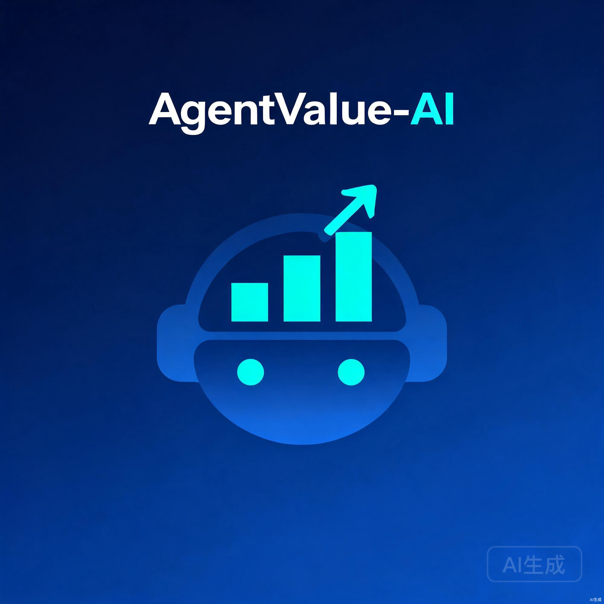

<p align="center">
  
</p>

<h1 align="center">AgentValue-AI</h1>

<p align="center">
  一个能对话、能操作电脑、能评估员工价值的 AI 智能体平台<br/>
  对标 ChatGPT / Claude.ai / opencode / Dify / Coze
</p>

<p align="center">
  <a href="LICENSE"></a>
  <a href="https://github.com/weed33834/agentvalue/actions/workflows/ci.yml"></a>
  <a href="https://github.com/weed33834/agentvalue/actions/workflows/security.yml"></a>
  
  
  
  
  
  
  <a href="CHANGELOG.md"></a>
  <a href="CONTRIBUTING.md"></a>
</p>

---

## 这是什么

AgentValue-AI 把三件事拼到了一个平台里:

**对话** — 完整的 AI 聊天界面,支持流式输出、工具调用展示、思考过程折叠、数学公式渲染、Markdown 导出。你在 ChatGPT 或 Claude.ai 上常用的操作,这里都有。

**工具调用** — Agent 能执行 bash 命令、读写文件、浏览目录、抓取网页、搜索代码、执行 Python 沙箱。14 个内置工具覆盖了日常操作,支持 MCP 协议接入 400+ 外部工具。生产环境可以按需开关高危工具。

**员工价值评估** — 持续接收员工的多维工作数据(日报、任务进度、代码贡献、会议记录、截图、语音),交给 LangGraph Agent 自动分析,一次推理同时产出三套视图:

| 视角 | 给谁看 | 说了什么 |
|---|---|---|
| 员工视角 | 本人 | 建设性成长反馈 |
| 管理视角 | 主管 / HR | 人才诊断与调配建议 |
| 审计视角 | 合规审计 | 每条结论带原始证据引用,可追溯 |

三套视图刻意分离。同一个判断,对员工说"成长空间",给主管看"ROI 下滑"——措辞和立场本就不该一样。所有评估必须经人工审批才能落地,这条是硬约束。

---

## 功能一览

### AI 对话

| 功能 | 说明 |
|---|---|
| 流式对话 | SSE 逐 token 输出,支持中断 |
| 工具调用展示 | 可折叠输入/输出,JSON 美化,状态图标 |
| 思考过程 | DeepSeek reasoning_content 可折叠展示 |
| 消息复制 | 代码块复制 + 整条消息复制 |
| 重新生成 | 删除末条回复重新执行 |
| 编辑消息 | inline 编辑用户消息 |
| Token 用量 | 每条消息显示 token 分解与响应延迟 |
| 会话管理 | 重命名、自动标题、搜索、Markdown 导出 |
| 数学公式 | KaTeX 行内 `$...$` 与块级 `$$...$$` |
| 图表渲染 | Mermaid 流程图、时序图懒加载 |
| 点赞反馈 | like/dislike 持久化 |
| 文件上传 | 多文件附件,10MB 限制 |
| 模型切换 | 下拉切换 8 种模型 |

### Agent 工具

| 工具 | 说明 | 安全约束 |
|---|---|---|
| `bash` | 执行 shell 命令 | 30s 超时 + 5000 字符截断 |
| `read_file` | 读取文件内容 | 5000 字符截断 |
| `write_file` | 写入文件 | 自动创建父目录 |
| `list_directory` | 列出目录内容 | — |
| `web_fetch` | 抓取网页 | HTML 转纯文本 + 截断 |
| `calculator` | 数学计算 | — |
| `get_current_datetime` | 获取日期时间 | — |
| `get_employee_history` | 查询员工历史评估 | 业务工具 |
| `query_company_kb` | 查询公司知识库 | 业务工具 |

工具经 `ToolRegistry` 统一管理,可通过 `enabled_tools` 配置按需开关。

### 运营管理平台

| 页面 | 路由 | 对标 |
|---|---|---|
| 模型供应商 | `/admin/providers` | Dify model-providers |
| Prompt 调试台 | `/admin/playground` | Langfuse Playground |
| 知识库管理 | `/admin/knowledge-base` | Dify Dataset |
| 链路追踪 | `/admin/trace` | Langfuse Trace |
| Token 趋势 | `/admin/metrics` | Langfuse Usage |
| 功能开关 | `/admin/feature-flags` | LaunchDarkly |
| 多 Agent 协作 | `/admin/multi-agent` | LangGraph Supervisor |
| 工作流编排 | `/admin/workflows` | Dify Workflow |
| 自定义工具 | `/admin/tools` | Dify Custom Tool |

---

## 系统架构

```
┌──────────────────────────────────────────────────────────┐
│              前端交互层 (Vue 3 + Element Plus)              │
│  员工端 │ 主管端 │ HR端 │ 管理后台 │ AI 对话界面             │
├──────────────────────────────────────────────────────────┤
│              API 网关层 (FastAPI)                           │
│  RBAC │ 限流 │ 审计日志 │ 护栏拦截 │ SSE 流式               │
├──────────────────────────────────────────────────────────┤
│              Agent 编排层 (LangGraph + ReAct 循环)         │
│  状态机 │ 工具调用 │ 记忆检索 │ 人工中断点                    │
├──────────────────────────────────────────────────────────┤
│              Agent 工具层 (9 个内置工具)                    │
│  bash │ read_file │ write_file │ list_directory │ web_fetch│
│  calculator │ datetime │ employee_history │ company_kb     │
├──────────────────────────────────────────────────────────┤
│              模型抽象层 (ModelRouter)                       │
│  硬件探测 │ 云端 API │ 本地 LM Studio │ 自动降级               │
├──────────────────────────────────────────────────────────┤
│              数据与记忆层                                   │
│  SQLite/PostgreSQL │ ChromaDB │ Redis(队列)                  │
└──────────────────────────────────────────────────────────┘
```

---

## 技术栈

| 层级 | 技术 |
|---|---|
| 前端 | Vue 3 + JavaScript + Vite + Element Plus + ECharts + Vue Flow + KaTeX + Mermaid |
| 后端 | Python 3.11+ + FastAPI + SQLAlchemy |
| Agent | LangGraph (supervisor 多 Agent + ReAct 循环 + SSE 流式) |
| LLM Provider | OpenAI / Anthropic Claude / Google Gemini / Ollama (凭证加密 + 负载均衡) |
| Rerank | Cohere / Jina / BGE (本地) / Dummy fallback |
| 流式响应 | sse-starlette + @microsoft/fetch-event-source |
| 向量记忆 | ChromaDB |
| 数据库 | SQLite (默认) / PostgreSQL (生产) |
| 缓存 | Redis (任务队列,未配置降级内存) |
| 可观测性 | Prometheus + Langfuse + Grafana |
| 工作流引擎 | 自研 DAG 执行器 (Kahn 拓扑排序 + 7 种节点 + 代码沙箱) |
| Feature Flag | 自研 5 级规则 (sha256 稳定哈希 + 60s LRU 缓存) |
| 测试 | pytest + locust (1517 passing) |
| 部署 | Docker Compose |

---

## 快速开始

### Docker Compose 一键启动

```bash
git clone https://gitcode.com/badhope/agentvalue.git
cd agentvalue
cp backend/.env.example backend/.env
docker compose up -d --build
```

启动后访问:

| 服务 | 地址 |
|---|---|
| 前端 | <http://localhost> |
| 后端 API | <http://localhost:8000> |
| 健康检查 | <http://localhost:8000/health> |
| Swagger UI | <http://localhost:8000/docs> |

### 本地开发

**后端:**

```bash
cd backend
python -m venv .venv && source .venv/bin/activate
pip install -r requirements.txt
cp .env.example .env                  # 填入模型 API Key
uvicorn main:app --reload --port 8000
```

**前端:**

```bash
cd frontend
npm install
npm run dev                           # http://localhost:5173
```

### 不配 API Key 也能跑

不配置任何模型 API Key 时,系统自动走 Mock Provider 端到端跑通评估流程:

```bash
cd backend
cp .env.example .env
AUTH_DEMO_MODE=true uvicorn main:app --reload
python -m eval.evaluate --mock        # 跑通评估,无需外部 API
```

> 演示模式仅限本地开发。`AUTH_DEMO_MODE=true` 允许通过 HTTP header 伪造身份,部署到非本机环境前必须关闭。

---

## 配置

所有配置通过 `backend/.env` 注入,详见 [backend/.env.example](backend/.env.example) 的逐项注释。

### 关键配置

| 配置项 | 用途 | 何时必须改 |
|---|---|---|
| `JWT_SECRET_KEY` | JWT 签名密钥 | 生产部署 |
| `AGENTVALUE_ENV` | 设为 `production` 触发生产守护 | 生产部署 |
| `CLOUD_API_KEY` | 云端 LLM (OpenAI 兼容) | 想用真实模型时 |
| `EMBEDDING_API_KEY` | 真实 Embedding 服务 | 想要语义检索时 |
| `CORS_ORIGINS` | 前端允许来源 | 生产必填实际域名 |
| `FIELD_ENCRYPTION_KEY` | 敏感字段 AES-GCM 加密 | 生产必填 |

### 模型档位

`MODEL_TIER` 控制评估时 LLM 走云端还是本地:

| 档位 | 场景 | 模型示例 |
|---|---|---|
| `auto` | 根据硬件自动推荐 (默认) | — |
| `L0` | 云端大模型 | GPT-4o / DeepSeek-V3 / Qwen-Max |
| `L1` | 边缘小模型 | Qwen2.5-0.5B |
| `L2` | 标准本地模型 | Qwen2.5-7B |
| `L3` | 本地旗舰模型 | Qwen2.5-14B |

未配置 `CLOUD_API_KEY` 与 `LOCAL_BASE_URL` 时走 Mock Provider,不依赖外部模型。

---

## 使用教程

### 1. 初始化数据

```bash
python -m scripts.seed_kb             # 公司知识库(评分标准、价值观、培训材料)
python -m scripts.seed_demo            # 演示数据(用户、一条样例评估)
```

### 2. 登录

四角色: `employee` / `manager` / `hr` / `admin`。

演示模式下,登录页有"演示账号一键填充"按钮。正常模式走 `/api/v1/auth/register` + `/api/v1/auth/login` 拿 JWT。

### 3. 发起评估

```bash
curl -X POST http://localhost:8000/api/v1/evaluations \
  -H "Authorization: Bearer <admin-token>" \
  -H "Content-Type: application/json" \
  -d '{
    "employee_id": "E1001",
    "period": "2026-W25",
    "raw_inputs": [
      {"type": "daily_report", "content": "今天完成订单中心接口重构..."},
      {"type": "task_progress", "content": "JIRA-2051 推进至联调阶段..."}
    ]
  }'
```

评估进入 LangGraph 状态机:

```
input_clean → multimodal_extract → llm_evaluate → parse_output → persist
                       ↑                                ↓
                   retrieve_context            human-in-the-loop interrupt
```

### 4. 审批与三视图

评估状态流转:

```
ai_drafted → manager_review → hr_audit(高风险才进) → approved/rejected
                                  ↓ rejected
                            employee_appeal → manager_review
```

查看三视图:

```bash
curl http://localhost:8000/api/v1/evaluations/{id} \
  -H "Authorization: Bearer <token>"
# 响应里的 employee_view / manager_view / audit_view 就是三视图
# 字段级可见性由 RBAC 控制:员工 token 看不到 manager_view / audit_view
```

### 5. AI 对话

管理后台 `/admin/chat` 提供完整的对话界面。创建会话后直接发消息:

```bash
# 创建会话
curl -X POST http://localhost:8000/api/v1/chat/sessions \
  -H "Authorization: Bearer <token>" \
  -H "Content-Type: application/json" \
  -d '{"title": "测试会话", "model_name": "DeepSeek-V4-Flash"}'

# 发送消息(SSE 流式响应)
curl -X POST http://localhost:8000/api/v1/chat/sessions/{id}/messages \
  -H "Authorization: Bearer <token>" \
  -H "Content-Type: application/json" \
  -d '{"content": "帮我列出当前目录下的文件"}'
```

Agent 会自动调用 `list_directory` 工具并返回格式化结果。

### 6. 可观测性

- Prometheus 指标: <http://localhost:8000/metrics> (21 项业务指标)
- Grafana 看板: 生产 compose 启动后 <http://localhost:3000>
- Langfuse 链路追踪: 配置 `LANGFUSE_*` 后自动上报
- 审计日志: 所有写操作入审计表,管理后台可分页查询

---

## 测试

```bash
cd backend && python -m pytest tests -q          # 单元测试
cd backend && python -m pytest -m e2e -q         # E2E 测试
cd backend && python -m eval.evaluate --mock      # Mock 评估
cd frontend && npm run lint                       # 前端 lint
cd frontend && npm run build                      # 前端构建
```

后端 1517 个测试通过,前端构建与 lint 无 error。

---

## 部署到生产

```bash
cp backend/.env.example backend/.env
# 编辑 .env,设置所有生产凭据
cd backend && python scripts/check_prod_readiness.py   # 就绪检查
docker compose -f docker-compose.yml -f docker-compose.prod.yml up -d --build
```

生产栈在基础 compose 之上叠加 PostgreSQL、MinIO、Prometheus + Grafana。

详细部署手册: [企业部署](docs/deployment-guide.md) | [试点 Runbook](docs/pilot-runbook.md) | [规模化扩展](docs/scale-deployment-runbook.md)

---

## 项目结构

```
.
├── backend/
│   ├── agent/            # LangGraph Agent + ReAct 循环 + 工具调用
│   ├── api/              # FastAPI 路由 (chat / auth / admin/*)
│   ├── auth/             # JWT + RBAC
│   ├── core/             # 配置 / 模型路由 / 护栏 / 工作流引擎 / Feature Flag
│   ├── models/           # SQLAlchemy 数据模型
│   ├── services/          # 业务服务
│   ├── tests/             # 1517 passing
│   └── ...
├── frontend/
│   ├── src/components/chat/   # 对话组件
│   ├── src/stores/chat.js     # 对话状态管理
│   ├── src/utils/markdown.js  # KaTeX + Mermaid 渲染
│   └── src/views/admin/       # 管理后台页面
├── docs/                 # 项目文档
├── monitoring/           # Prometheus 配置
├── grafana/              # Grafana Dashboard
├── .github/              # CI / Issue 模板 / PR 模板
├── docker-compose.yml    # 开发栈
├── docker-compose.prod.yml
└── CHANGELOG.md
```

---

## 文档索引

| 文档 | 说明 |
|---|---|
| [CHANGELOG.md](CHANGELOG.md) | 版本变更记录 |
| [CONTRIBUTING.md](CONTRIBUTING.md) | 贡献指南 |
| [SECURITY.md](SECURITY.md) | 安全漏洞报告流程 |
| [CODE_OF_CONDUCT.md](CODE_OF_CONDUCT.md) | 行为准则 |
| [backend/README.md](backend/README.md) | 后端开发说明 |
| [frontend/README.md](frontend/README.md) | 前端开发说明 |
| [docs/architecture-notes.md](docs/architecture-notes.md) | 架构实现说明 |
| [docs/deployment-guide.md](docs/deployment-guide.md) | 企业部署手册 |
| [docs/dev-guidelines.md](docs/dev-guidelines.md) | 开发规范 |
| [docs/DEVELOPMENT-PLAN.md](docs/DEVELOPMENT-PLAN.md) | 开发计划 |

---

## Roadmap

**已完成版本:**

- v1.2 — 模型供应商管理 + Prompt 调试台 + 多 Provider 接入
- v1.3 — arq 任务队列 + Postgres 持久化 + 测试补全 + CI 加固 + 飞书/GitLab 集成骨架
- v1.4 — 知识库 UI / 链路追踪 / Token 趋势 / Rerank / 自定义工具 / Feature Flag / Multi-Agent / 工作流编排
- v1.5 — AI 对话系统 (10 项功能) + Agent 工具层 (5 个工具)

**后续方向:**

- 对话附件上传解析 (图片/PDF/音频)
- 流式中断恢复与对话分支
- 对话分享链接
- 多模态能力补齐 (云端 OCR / Whisper ASR)
- 团队 ROI 九宫格与成长路径看板增强
- IM 集成落地 (飞书)
- 代码仓库集成落地 (GitLab)

如果你有想推进的方向,欢迎到 [GitCode Issues](https://gitcode.com/badhope/agentvalue/issues) 提议。

---

## FAQ

**不配 API Key 能跑吗?**

能。系统默认走 Mock Provider,评估流程端到端跑通,但 LLM 输出是模拟的。真实使用必须配置 `CLOUD_API_KEY` 或 `LOCAL_BASE_URL`。

**评估结果能直接用于人事决策吗?**

不能。"AI 不做人事决策"是核心硬约束:所有评估必须经主管审批,高风险项还要 HR 复核。Agent 只负责生成与结构化呈现,不替人下结论。

**Agent 的 bash 工具安全吗?**

设有 30 秒超时和 5000 字符输出截断。所有工具经 `ToolRegistry` 统一管理,可通过 `enabled_tools` 配置开关。生产环境可只启用 `calculator,get_current_datetime` 等安全工具。

**AI 对话支持哪些模型?**

默认 `DeepSeek-V4-Flash` (OpenAI 兼容网关),前端下拉支持 DeepSeek V4 Flash/Pro、GLM 4.7/5.1、Qwen 3 Coder、Kimi K2.6、MiniMax M3。只要 Provider 支持 OpenAI 兼容 API + function calling 即可接入。

**多租户隔离是怎么做的?**

数据层每个表带 `tenant_id` 字段,RBAC 在数据级过滤;向量库按 tenant 分 collection;任务队列前缀带 tenant。

---

## 贡献

欢迎通过 Issue 与 PR 贡献代码或反馈问题。开始前请阅读 [CONTRIBUTING.md](CONTRIBUTING.md)。CI 在每次 PR 上自动跑 lint / 测试 / 构建,全绿才能合并。

---

## 安全

发现安全漏洞请按 [SECURITY.md](SECURITY.md) 流程私密报告,不要开公开 Issue。

---

## Mirror

| 平台 | 地址 | 说明 |
|---|---|---|
| GitCode (主仓) | <https://gitcode.com/badhope/agentvalue> | Issue / PR 提交 |
| GitHub (镜像) | <https://github.com/weed33834/agentvalue> | 国际镜像 |

---

## 许可证

本项目基于 [Custom Non-Commercial License (CNCL) v1.0](LICENSE) 开源。© 2026 AgentValue-AI Contributors.
