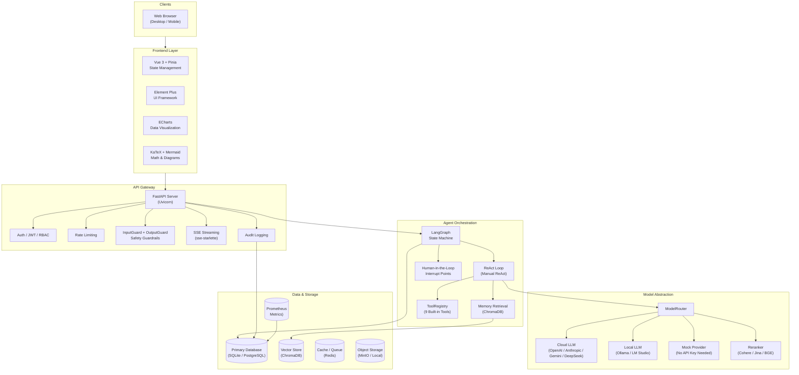
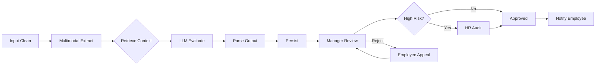
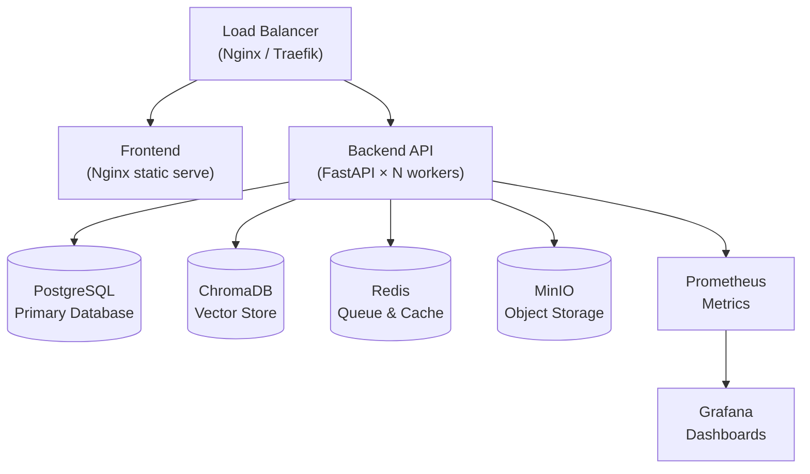
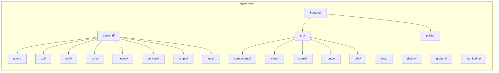

<p align="center">
  
</p>

<h1 align="center">AgentValue</h1>

<p align="center">
  <strong>AI-Powered Employee Value Quantification & Growth Platform</strong><br/>
  Conversational AI · Agent Tools · Automated Evaluation · 3-View Assessment System
</p>

<p align="center">
  <a href="README.md"></a>
  <a href="README.zh-CN.md"></a>
  <a href="README.ja-JP.md"></a>
</p>

<p align="center">
  <a href="LICENSE"></a>
  
  
  
  
  
  
  <a href="CHANGELOG.md"></a>
  <a href="https://gitcode.com/badhope/agentvalue/issues"></a>
</p>

<p align="center">
  <a href="#-features">Features</a> •
  <a href="#-architecture">Architecture</a> •
  <a href="#-quick-start">Quick Start</a> •
  <a href="#-configuration">Configuration</a> •
  <a href="#-usage-guide">Usage</a> •
  <a href="#-deployment">Deployment</a> •
  <a href="#-multi-language">🌐 中文</a> •
  <a href="#-multi-language">🇯🇵 日本語</a>
</p>

---

## ✨ Features

### 🤖 AI Chat

| Feature | Description |
|---|---|
| **Streaming Response** | SSE token-by-token output with abort support |
| **Tool Call Display** | Collapsible I/O, JSON beautification, status icons |
| **Thought Process** | Collapsible `reasoning_content` (DeepSeek / Gemini / Claude) |
| **Message Actions** | Copy code block / entire message, edit user message, regenerate |
| **Session Management** | Auto-title, rename, search, Markdown export |
| **Math Rendering** | KaTeX inline `$...$` and block `$$...$$` |
| **Diagram Rendering** | Mermaid flowchart & sequence diagram, lazy-loaded |
| **File Upload** | Multi-file attachments, 10 MB limit |
| **Model Switching** | 8+ models via dropdown |
| **Feedback** | Like/dislike with persistence |

### 🛠 Agent Tool System

| Tool | Description | Security |
|---|---|---|
| `bash` | Execute shell commands | 30s timeout, 5000-char truncation |
| `read_file` | Read file contents | 5000-char truncation |
| `write_file` | Write to files | Auto-creates parent directories |
| `list_directory` | List directory contents | — |
| `web_fetch` | Fetch & parse web pages | HTML-to-text, truncated |
| `calculator` | Arithmetic & math expressions | — |
| `get_current_datetime` | Current date/time | — |
| `get_employee_history` | Query past evaluations | Business tool |
| `query_company_kb` | Query company knowledge base | Business tool |

All tools managed through `ToolRegistry`. Enable/disable per environment via `enabled_tools`.

### 📊 Employee Value Evaluation

The core differentiator — a multi-perspective AI evaluation system:

| Perspective | Audience | Purpose |
|---|---|---|
| **Employee View** | The employee | Constructive growth feedback, strengths & areas for improvement |
| **Manager View** | Manager / HR | Talent diagnosis, ROI analysis, team composition suggestions |
| **Audit View** | Compliance / Audit | Every conclusion linked to original evidence, fully traceable |

All evaluations go through **mandatory human approval** before taking effect. The AI generates structured assessments — humans make decisions.

### 👥 Role-Based Dashboards

| Portal | Route | Role | Key Features |
|---|---|---|---|
| Employee | `/employee` | `employee` | Growth dashboard, radar chart, daily input, history, feedback, growth path |
| Manager | `/manager` | `manager`, `admin` | Team value ranking, risk analysis, pending approvals, ROI 9-box |
| HR | `/hr` | `hr`, `admin` | Review queue, audit detail, grievances, appeal tracking |
| Admin | `/admin` | `admin` | Model management, LLM config, provider config, prompt tools, audit logs, security, billing |

### ⚙️ Admin Console (40+ Management Pages)

| Category | Pages |
|---|---|
| **Model & LLM** | Model management, LLM config, Model providers, Prompt playground, Prompt management, Model fallback |
| **Agent & Tools** | Agent presets, Skills, Custom tools, Workflow orchestration, Multi-agent |
| **Observability** | Trace viewer, Token metrics, API health, Audit logs, Debug trace |
| **Evaluation** | Talent matrix, LLM judge, RAG evaluation, Human annotation, Dataset management |
| **Security & Compliance** | Security governance, Sensitive words, SSO config, Quota & budget, Billing |
| **Content & Knowledge** | Knowledge base, Document parsing, NL2SQL, Mixed search |
| **Operations** | Feature flags, Alert management, Scheduled tasks, Release ops, Model ops |

> Pages marked with `*` have backend API & data models; admin UI is under construction. All other routes have fully functional frontend pages.

---

## 🏗 Architecture


```mermaid
graph TB
    subgraph CLIENTS["Clients"]
        WEB["Web Browser<br/>(Desktop / Mobile)"]
    end

    subgraph FRONTEND["Frontend Layer"]
        VUE["Vue 3 + Pinia<br/>State Management"]
        EUI["Element Plus<br/>UI Framework"]
        ECH["ECharts<br/>Data Visualization"]
        KTX["KaTeX + Mermaid<br/>Math & Diagrams"]
    end

    subgraph GATEWAY["API Gateway"]
        FAST["FastAPI Server<br/>(Uvicorn)"]
        AUTH["Auth / JWT / RBAC"]
        RATE["Rate Limiting"]
        GUARD["InputGuard + OutputGuard<br/>Safety Guardrails"]
        SSE_["SSE Streaming<br/>(sse-starlette)"]
        AUDIT_["Audit Logging"]
    end

    subgraph AGENT["Agent Orchestration"]
        LG["LangGraph<br/>State Machine"]
        REACT["ReAct Loop<br/>(Manual ReAct)"]
        HITL["Human-in-the-Loop<br/>Interrupt Points"]
        MEMORY["Memory Retrieval<br/>(ChromaDB)"]
        TOOL["ToolRegistry<br/>(9 Built-in Tools)"]
    end

    subgraph MODEL["Model Abstraction"]
        MR["ModelRouter"]
        CLOUD["Cloud LLM<br/>(OpenAI / Anthropic / Gemini / DeepSeek)"]
        LOCAL["Local LLM<br/>(Ollama / LM Studio)"]
        MOCK["Mock Provider<br/>(No API Key Needed)"]
        RERANK["Reranker<br/>(Cohere / Jina / BGE)"]
    end

    subgraph DATA["Data & Storage"]
        DB[("Primary Database<br/>(SQLite / PostgreSQL)")]
        VEC[("Vector Store<br/>(ChromaDB)")]
        REDIS[("Cache / Queue<br/>(Redis)")]
        OBJ[("Object Storage<br/>(MinIO / Local)")]
        PROM[("Prometheus<br/>Metrics)")]
    end

    CLIENTS --> FRONTEND
    FRONTEND --> FAST
    FAST --> AUTH
    FAST --> RATE
    FAST --> GUARD
    FAST --> SSE_
    FAST --> AUDIT_
    FAST --> LG
    LG --> REACT
    LG --> HITL
    REACT --> MEMORY
    REACT --> TOOL
    REACT --> MR
    MR --> CLOUD
    MR --> LOCAL
    MR --> MOCK
    MR --> RERANK
    LG --> DB
    MEMORY --> VEC
    AUDIT_ --> DB
    PROM --> DB
```

### Tech Stack

| Layer | Technology |
|---|---|
| **Frontend** | Vue 3 (JavaScript) · Vite · Element Plus · ECharts · Vue Flow · KaTeX · Mermaid |
| **Backend** | Python 3.11+ · FastAPI · SQLAlchemy · Alembic |
| **Agent Framework** | LangGraph (supervisor multi-agent + ReAct loop + SSE streaming) |
| **LLM Providers** | OpenAI / Anthropic Claude / Google Gemini / DeepSeek / Qwen / Ollama (encrypted credentials + load balancing) |
| **Reranker** | Cohere / Jina / BGE (local) / Dummy fallback |
| **Streaming** | sse-starlette + @microsoft/fetch-event-source |
| **Vector Memory** | ChromaDB |
| **Database** | SQLite (default) / PostgreSQL (production) |
| **Cache / Queue** | Redis (in-memory fallback when not configured) |
| **Observability** | Prometheus + Langfuse + Grafana + Loki |
| **Workflow Engine** | Custom DAG executor (Kahn topological sort, 7 node types, code sandbox) |
| **Feature Flags** | Custom 5-tier rules engine (sha256 consistent hashing, 60s LRU cache) |
| **Testing** | pytest (backend) + Vitest (frontend) + Playwright (E2E) + Locust (perf) |
| **Deployment** | Docker Compose (dev + prod) · Kubernetes manifests available |
| **Security** | InputGuard + OutputGuard (PII masking, jailbreak detection, bias detection, hallucination marking) |

---

## 🚀 Quick Start

### Prerequisites

| Dependency | Version | Purpose |
|---|---|---|
| Python | 3.11+ | Backend runtime |
| Node.js | 20+ | Frontend dev server & build |
| Docker & Compose | 24+ / 2.24+ | Containerized deployment (recommended) |
| Git | 2.30+ | Source control |
| Make | — | Helper commands (optional) |

### Option 1: Docker Compose (Recommended)

```bash
# Clone the repository
git clone https://gitcode.com/badhope/agentvalue.git
cd agentvalue

# Copy environment config
cp backend/.env.example backend/.env

# Edit .env — at minimum set JWT_SECRET_KEY and CLOUD_API_KEY
# See Configuration section for details

# Start all services
docker compose up -d --build
```

After startup, access:

| Service | URL |
|---|---|
| Frontend | http://localhost |
| Backend API | http://localhost:8000 |
| Health Check | http://localhost:8000/health |
| Swagger UI | http://localhost:8000/docs |
| Grafana | http://localhost:3000 (production only) |

### Option 2: Local Development

**Backend:**

```bash
cd backend
python -m venv .venv && source .venv/bin/activate  # or .venv\Scripts\activate on Windows
pip install -r requirements.txt
cp .env.example .env
# Edit .env — fill in your API keys
uvicorn main:app --reload --port 8000
```

**Frontend:**

```bash
cd frontend
npm install
npm run dev
# Opens at http://localhost:5173
```

The Vite dev server proxies `/api/*` requests to `http://localhost:8000` automatically.

### Option 3: Run Without Any API Key (Mock Mode)

```bash
cd backend
cp .env.example .env
uvicorn main:app --reload --port 8000
# Mock Provider is auto-selected when no LLM API key is configured

# Run a mock evaluation (end-to-end, no external dependencies)
python -m eval.evaluate --mock
```

> **Important:** Demo mode (`AUTH_DEMO_MODE=true`) lets you bypass JWT auth by passing a role header. This is for local development ONLY — **never enable in production**.

---

## ⚙️ Configuration

Configuration is managed through environment variables (`.env` file). Copy `backend/.env.example` to `backend/.env` and customize.

### Essential Configuration

| Variable | Default | Description | Required For |
|---|---|---|---|
| `JWT_SECRET_KEY` | `change-me` | JWT signing secret — **must change for production** | Production |
| `AGENTVALUE_ENV` | `development` | Set to `production` to enable production safeguards | Production |
| `CLOUD_API_KEY` | — | API key for cloud LLM (OpenAI-compatible endpoint) | Using cloud LLM |
| `DATABASE_URL` | `sqlite+aiosqlite:///./agentvalue.db` | Database connection string | Any |
| `CORS_ORIGINS` | `http://localhost:5173` | Allowed CORS origins | Production (set to actual domain) |
| `FIELD_ENCRYPTION_KEY` | — | AES-GCM key for encrypting sensitive DB fields | Production |

### LLM Provider Configuration

| Variable | Default | Description |
|---|---|---|
| `CLOUD_API_KEY` | — | Primary cloud LLM API key (OpenAI-compatible) |
| `CLOUD_BASE_URL` | `https://api.openai.com/v1` | Cloud LLM endpoint |
| `CLOUD_MODEL` | `gpt-4o-mini` | Default cloud model |
| `OPENAI_API_KEY` | — | Legacy fallback (used when `CLOUD_*` is not set) |
| `LOCAL_BASE_URL` | `http://localhost:1234/v1` | Local LLM endpoint (Ollama / LM Studio) |
| `LOCAL_MODEL_L1` | `qwen2.5-0.5b` | Edge-tier local model |
| `LOCAL_MODEL_L2` | `qwen2.5-7b` | Standard local model |
| `LOCAL_MODEL_L3` | `qwen2.5-14b` | Flagship local model |

### Model Tiers

| Tier | Use Case | Example |
|---|---|---|
| `auto` | Auto-detect from hardware (default) | — |
| `L0` | Cloud flagship | GPT-4o, DeepSeek-V3, Qwen-Max |
| `L1` | Edge/small local | Qwen2.5-0.5B |
| `L2` | Standard local | Qwen2.5-7B |
| `L3` | Local flagship | Qwen2.5-14B |

When neither `CLOUD_API_KEY` nor `LOCAL_BASE_URL` is configured, the system falls back to **Mock Provider** — all LLM calls return deterministic mock responses so the entire evaluation flow works end-to-end for testing.

### Embedding & Vector Store

| Variable | Default | Description |
|---|---|---|
| `EMBEDDING_API_KEY` | — | Embedding service API key |
| `EMBEDDING_BASE_URL` | `https://api.openai.com/v1` | Embedding endpoint |
| `EMBEDDING_MODEL` | `text-embedding-3-small` | Embedding model |
| `EMBEDDING_DIMENSIONS` | `1536` | Must match the model (cloud 1536, BGE 1024) |
| `VECTOR_STORE_DIR` | `./chroma_db` | Vector database storage path |

> **Important:** When switching from Mock to a real embedding model, you must rebuild the vector store: `python -m scripts.seed_kb --clear`.

### Security Configuration

| Variable | Default | Description |
|---|---|---|
| `JWT_SECRET_KEY` | `change-me` | JWT signing secret (min 32 chars) |
| `JWT_ALGORITHM` | `HS256` | Signing algorithm |
| `JWT_EXPIRE_MINUTES` | `1440` | Token expiration (24 hours) |
| `FIELD_ENCRYPTION_KEY` | — | 32-char hex key for AES-GCM field encryption |
| `CORS_ORIGINS` | `http://localhost:5173` | Comma-separated allowed origins |
| `INPUTGUARD_ENABLED` | `true` | Enable input content guard |
| `OUTPUTGUARD_ENABLED` | `true` | Enable output content guard |

### Observability

| Variable | Default | Description |
|---|---|---|
| `LANGFUSE_PUBLIC_KEY` | — | Langfuse tracing public key |
| `LANGFUSE_SECRET_KEY` | — | Langfuse tracing secret key |
| `LANGFUSE_HOST` | — | Langfuse self-hosted URL |
| `PROMETHEUS_MULTIPROC_DIR` | — | Prometheus multiprocess temp dir |

> A full `backend/.env.example` with all configurable variables and inline comments is [available here](backend/.env.example).

---

## 📖 Usage Guide

### 1. Initialize Seed Data

```bash
# Seed the knowledge base (scoring criteria, company values, training materials)
python -m scripts.seed_kb

# Seed demo users & sample evaluation
python -m scripts.seed_demo
```

### 2. Login

Four built-in roles:

```bash
# Register a new user
curl -X POST http://localhost:8000/api/v1/auth/register \
  -H "Content-Type: application/json" \
  -d '{"email": "user@company.com", "password": "securepass", "name": "User Name", "role": "employee"}'

# Login
curl -X POST http://localhost:8000/api/v1/auth/login \
  -H "Content-Type: application/json" \
  -d '{"email": "user@company.com", "password": "securepass"}'
# Returns: {"access_token": "eyJ...", "token_type": "bearer", "user_id": "...", "name": "...", "role": "employee"}
```

In **Demo Mode** (local dev only), the login page has a one-click demo account button.

### 3. Run an Evaluation

```bash
curl -X POST http://localhost:8000/api/v1/evaluations \
  -H "Authorization: Bearer <admin-token>" \
  -H "Content-Type: application/json" \
  -d '{
    "employee_id": "E1001",
    "period": "2026-W25",
    "raw_inputs": [
      {"type": "daily_report", "content": "Completed order center API refactoring..."},
      {"type": "task_progress", "content": "JIRA-2051: integration testing phase..."},
      {"type": "code_contributions", "content": "PR #342 merged: 15 files, +342/-89 lines"}
    ]
  }'
```

The evaluation flows through a LangGraph state machine:


```mermaid
flowchart LR
    A[Input Clean] --> B[Multimodal Extract]
    B --> C{Retrieve Context}
    C --> D[LLM Evaluate]
    D --> E[Parse Output]
    E --> F[Persist]
    F --> G[Manager Review]
    G --> H{High Risk?}
    H -- Yes --> I[HR Audit]
    H -- No --> J[Approved]
    I --> J
    J --> K[Notify Employee]
    G -- Reject --> L[Employee Appeal]
    L --> G
```

### 4. View Evaluation Results (3-View System)

```bash
curl http://localhost:8000/api/v1/evaluations/{id} \
  -H "Authorization: Bearer <token>"
```

The response contains three parallel views, each tailored to its audience:

- `employee_view`: Growth-oriented feedback, strengths, suggested actions
- `manager_view`: ROI analysis, risk flags, team composition insights
- `audit_view`: Every conclusion with source evidence citations

**Field-level visibility is enforced by RBAC** — an employee token cannot access `manager_view` or `audit_view`.

### 5. AI Chat

Navigate to `/admin/chat` in the browser, or use the API:

```bash
# Create a chat session
curl -X POST http://localhost:8000/api/v1/chat/sessions \
  -H "Authorization: Bearer <token>" \
  -H "Content-Type: application/json" \
  -d '{"title": "Research Session", "model_name": "DeepSeek-V4-Flash"}'

# Send a message (SSE streaming response)
curl -X POST http://localhost:8000/api/v1/chat/sessions/{id}/messages \
  -H "Authorization: Bearer <token>" \
  -H "Content-Type: application/json" \
  -d '{"content": "List the files in the current directory"}'

# List sessions
curl http://localhost:8000/api/v1/chat/sessions \
  -H "Authorization: Bearer <token>"

# Export a session as Markdown
curl http://localhost:8000/api/v1/chat/sessions/{id}/export \
  -H "Authorization: Bearer <token>" \
  -o session.md
```

### 6. Observability

| Feature | URL / Endpoint | Description |
|---|---|---|
| Prometheus Metrics | http://localhost:8000/metrics | 21+ business metrics |
| Grafana Dashboard | http://localhost:3000 (prod) | Visual metrics & alerting |
| Langfuse Tracing | Configure `LANGFUSE_*` | Full LLM trace viewer |
| Audit Logs | `/admin/audit-logs` | All write operations, paginated |
| Health Check | http://localhost:8000/health | Service readiness |

---

## 🧪 Testing

```bash
# Backend unit tests (1517+ tests)
cd backend && python -m pytest tests -q

# Backend E2E tests
cd backend && python -m pytest -m e2e -q

# Backend mock evaluation (no external deps)
cd backend && python -m eval.evaluate --mock

# Backend enterprise tests (122 tests)
cd backend && python -m pytest tests/enterprise/ -q

# Frontend tests
cd frontend && npm run lint          # ESLint
cd frontend && npx vitest run        # Vitest (47+ tests)
cd frontend && npm run build         # Build check

# Load testing
cd backend && locust -f tests/perf/locustfile.py --headless -u 100 -r 10
```

---

## 📦 Deployment

### Docker Compose (Development)

```bash
docker compose up -d --build
```

### Docker Compose (Production)

```bash
cp backend/.env.example backend/.env
# Edit .env — set all production credentials

# Run production readiness check
cd backend && python scripts/check_prod_readiness.py

# Start production stack (adds PostgreSQL, MinIO, Prometheus + Grafana)
docker compose -f docker-compose.yml -f docker-compose.prod.yml up -d --build
```

### Production Architecture


```mermaid
graph TB
    LB["Load Balancer<br/>(Nginx / Traefik)"] --> FE["Frontend<br/>(Nginx static serve)"]
    LB --> BE["Backend API<br/>(FastAPI × N workers)"]
    BE --> PG[("PostgreSQL<br/>Primary Database")]
    BE --> CH[("ChromaDB<br/>Vector Store")]
    BE --> RD[("Redis<br/>Queue & Cache")]
    BE --> MI[("MinIO<br/>Object Storage")]
    BE --> PRO["Prometheus<br/>Metrics"]
    PRO --> GR["Grafana<br/>Dashboards"]
```

### Deployment Checklist

- [ ] Generate strong `JWT_SECRET_KEY` (min 32 random characters)
- [ ] Generate `FIELD_ENCRYPTION_KEY` (64 hex chars via `openssl rand -hex 32`)
- [ ] Set `AGENTVUE_ENV=production`
- [ ] Set `CORS_ORIGINS` to actual frontend domain(s)
- [ ] Switch `DATABASE_URL` to PostgreSQL
- [ ] Configure `REDIS_URL` for task queue
- [ ] Set up HTTPS (TLS termination at reverse proxy)
- [ ] Disable demo auth: in `frontend/src/utils/auth.js`, ensure `isDemoAuthEnabled()` returns `false`
- [ ] Configure `CLOUD_API_KEY` or set up local LLM endpoint
- [ ] Run `python scripts/check_prod_readiness.py` and fix any warnings
- [ ] Configure monitoring alerts (see `docs/alerting-rules.md`)

### Detailed Deployment Guides

| Guide | Description |
|---|---|
| [Deployment Guide](docs/deployment-guide.md) | Full production deployment walkthrough |
| [Pilot Runbook](docs/pilot-runbook.md) | Step-by-step pilot deployment & validation |
| [Scale Deployment](docs/scale-deployment-runbook.md) | Scaling, HA, multi-region |
| [Kubernetes Manifests](deploy/k8s/) | K8s deployment YAML files |

---

## 📂 Project Structure


```mermaid
graph LR
    subgraph ROOT["agentvalue/"]
        BE["backend/"] --> BE_AGENT["agent/"]
        BE --> BE_API["api/"]
        BE --> BE_AUTH["auth/"]
        BE --> BE_CORE["core/"]
        BE --> BE_MODEL["models/"]
        BE --> BE_SRV["services/"]
        BE --> BE_SCR["scripts/"]
        BE --> BE_TST["tests/"]
        FE["frontend/"] --> FE_SRC["src/"]
        FE_SRC --> FE_COMP["components/"]
        FE_SRC --> FE_VIEW["views/"]
        FE_SRC --> FE_STORE["stores/"]
        FE_SRC --> FE_ROUT["router/"]
        FE_SRC --> FE_UTIL["utils/"]
        FE --> FE_PUB["public/"]
        DOCS["docs/"]
        DEPLOY["deploy/"]
        GRA["grafana/"]
        MON["monitoring/"]
    end
```

| Path | Description |
|---|---|
| `backend/` | FastAPI Python backend |
| `backend/agent/` | LangGraph state machine, ReAct loop, tool definitions |
| `backend/api/` | REST API routes (chat, auth, admin, evaluations) |
| `backend/auth/` | JWT authentication & RBAC enforcement |
| `backend/core/` | Config, model router, guards, workflow engine, feature flags |
| `backend/models/` | SQLAlchemy ORM models |
| `backend/services/` | Business logic services |
| `backend/scripts/` | Data seeding, migration, production readiness check |
| `backend/tests/` | 1500+ unit, integration, and E2E tests |
| `frontend/` | Vue 3 frontend application |
| `frontend/src/views/` | Role-based page views (employee, manager, hr, admin, mobile) |
| `frontend/src/components/` | Reusable Vue components (chat, evaluation, layout) |
| `frontend/src/stores/` | Pinia state management modules |
| `frontend/src/router/` | Vue Router configuration with role-based guards |
| `docs/` | Architecture docs, deployment guides, ADR records |
| `deploy/k8s/` | Kubernetes deployment manifests |
| `monitoring/` | Prometheus alerting rules & configuration |

---

## 🔒 Enterprise-Grade Security & Compliance

### Security Layers

| Layer | Implementation |
|---|---|
| **Authentication** | JWT (HS256/RS256) with token expiration & audience validation |
| **Authorization** | RBAC with field-level data visibility |
| **Input Guard** | PII masking, prompt injection detection, jailbreak detection |
| **Output Guard** | Bias detection, hallucination marking, sensitive content filter |
| **Data Encryption** | AES-256-GCM field-level encryption for sensitive columns |
| **Tool Safety** | 30s timeout, output truncation, per-tool enable/disable |
| **Audit Trail** | All write operations logged (who, what, when, old/new values) |
| **Rate Limiting** | Per-user & per-IP rate limiting at API gateway |

### Compliance Checklist

- **Data Privacy**: GDPR-ready audit trail, data retention policies, right-to-forget
- **Fairness**: Bias detection in evaluation output, fairness audit scripts
- **Human Oversight**: Hard constraint — AI creates assessments, humans make decisions
- **Evidence Traceability**: Every evaluation conclusion links to source evidence
- **Access Control**: Role-based dashboards, field-level API visibility
- **Secure by Default**: All guardrails enabled by default in production mode

> See `docs/dev-guidelines.md` for security development guidelines.

---

## 🌐 Multi-Language

This README is available in:

| Language | File |
|---|---|
| 🇬🇧 English | [README.md](README.md) |
| 🇨🇳 简体中文 | [README.zh-CN.md](README.zh-CN.md) |
| 🇯🇵 日本語 | [README.ja-JP.md](README.ja-JP.md) |

> The application UI currently supports Chinese (default). Internationalization (i18n) for English and Japanese is in the roadmap.

---

## ❓ FAQ

**Can it run without any API key?**

Yes. When no LLM API key is configured, the system uses Mock Provider — all LLM calls return deterministic mock responses. The entire evaluation pipeline works end-to-end. For real usage, configure `CLOUD_API_KEY` or `LOCAL_BASE_URL`.

**Can evaluation results be used for HR decisions?**

**No.** "AI does not make people decisions" is a hard constraint. All evaluations must go through manager approval. High-risk items additionally require HR review. The AI generates structured assessments — humans make and implement decisions.

**Is the bash tool safe?**

It has a 30-second timeout and 5000-character output truncation. All tools are managed through `ToolRegistry` and can be individually enabled/disabled via `enabled_tools`. In production, you can restrict to only `calculator` and `get_current_datetime`.

**What models are supported?**

The system supports any OpenAI-compatible API with function calling. Pre-configured: DeepSeek V4 Flash/Pro, GLM 4.7/5.1, Qwen 3 Coder, Kimi K2.6, MiniMax M3, GPT-4o, Claude Sonnet, Gemini 2.0.

**How is multi-tenancy handled?**

Each database table includes a `tenant_id` field. RBAC enforces data-level filtering. ChromaDB collections are separated by tenant. Task queue prefixes include tenant ID.

**Can I deploy it on-premises?**

Yes. The entire platform is self-contained and deployable via Docker Compose or Kubernetes. No external SaaS dependency for core functionality (LLM providers are optional plug-ins).

---

## 🤝 Contributing

Contributions are welcome! Please read [CONTRIBUTING.md](CONTRIBUTING.md) before submitting issues or PRs.

- **Issue tracking**: [GitCode Issues](https://gitcode.com/badhope/agentvalue/issues)
- **PR workflow**: CI (lint + test + build) must pass all checks before merge

---

## 🐛 Security

Report security vulnerabilities privately via [SECURITY.md](SECURITY.md) — do **not** open public issues.

---

## 📚 Documentation Index

| Document | Description |
|---|---|
| [CHANGELOG.md](CHANGELOG.md) | Full version history & release notes |
| [CONTRIBUTING.md](CONTRIBUTING.md) | Contribution guidelines |
| [SECURITY.md](SECURITY.md) | Security vulnerability reporting |
| [CODE_OF_CONDUCT.md](CODE_OF_CONDUCT.md) | Community code of conduct |
| [backend/README.md](backend/README.md) | Backend development guide |
| [frontend/README.md](frontend/README.md) | Frontend development guide |
| [docs/architecture-notes.md](docs/architecture-notes.md) | Architecture implementation details |
| [docs/deployment-guide.md](docs/deployment-guide.md) | Enterprise deployment manual |
| [docs/dev-guidelines.md](docs/dev-guidelines.md) | Development standards & patterns |
| [docs/DEVELOPMENT-PLAN.md](docs/DEVELOPMENT-PLAN.md) | Development roadmap & planning |
| [docs/DEVELOPER_CHECKLIST.md](docs/DEVELOPER_CHECKLIST.md) | Developer onboarding checklist |
| [docs/pilot-runbook.md](docs/pilot-runbook.md) | Pilot deployment runbook |
| [docs/scale-deployment-runbook.md](docs/scale-deployment-runbook.md) | Scale deployment & HA guide |
| [docs/alerting-rules.md](docs/alerting-rules.md) | Production alerting rules |
| [backend/.env.example](backend/.env.example) | Full environment variable reference |

---

## 📜 License

This project is licensed under the **Custom Non-Commercial License (CNCL) v1.0**. See [LICENSE](LICENSE) for details. © 2026 AgentValue Contributors.

---

### Mirrors

| Platform | URL | Purpose |
|---|---|---|
| GitCode (Primary) | https://gitcode.com/badhope/agentvalue | Issues & PRs |
| GitHub (Mirror) | https://github.com/weed33834/agentvalue | International mirror |

## Mirrors / 镜像

This repository is primarily hosted on **GitHub** and mirrored to GitCode and Gitee for accessibility.

| Platform | URL |
|----------|-----|
| **GitHub** (primary) | https://github.com/weed33834/agentvalue |
| GitCode (mirror) | https://gitcode.com/badhope/agentvalue |
| Gitee (mirror) | https://gitee.com/badhope/agentvalue |

> Content is synchronized manually across platforms. GitHub is the canonical source.
