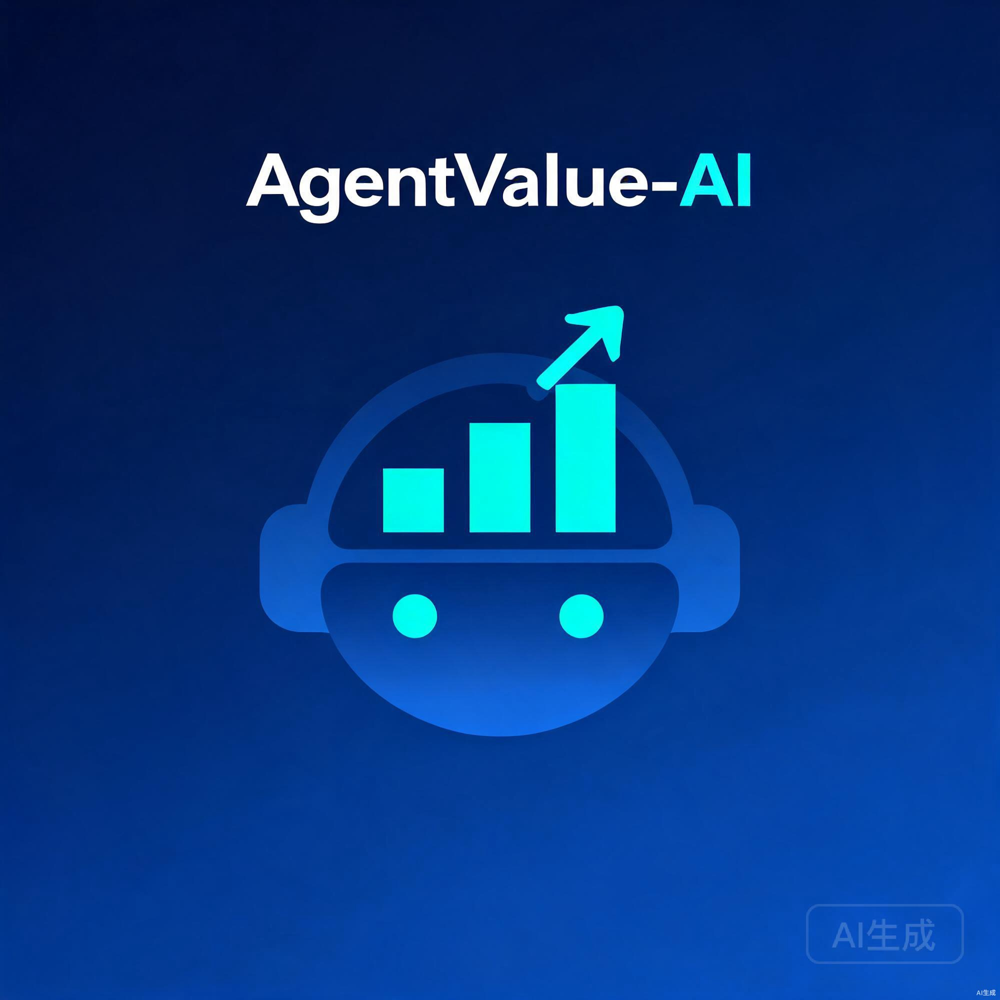
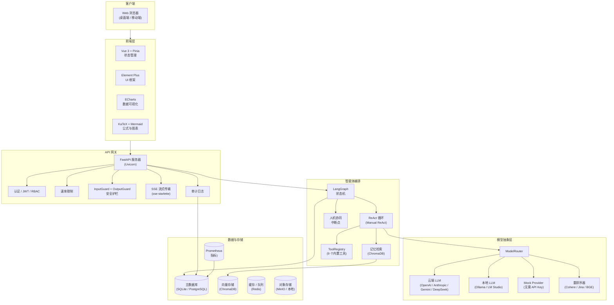
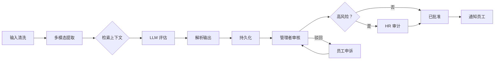
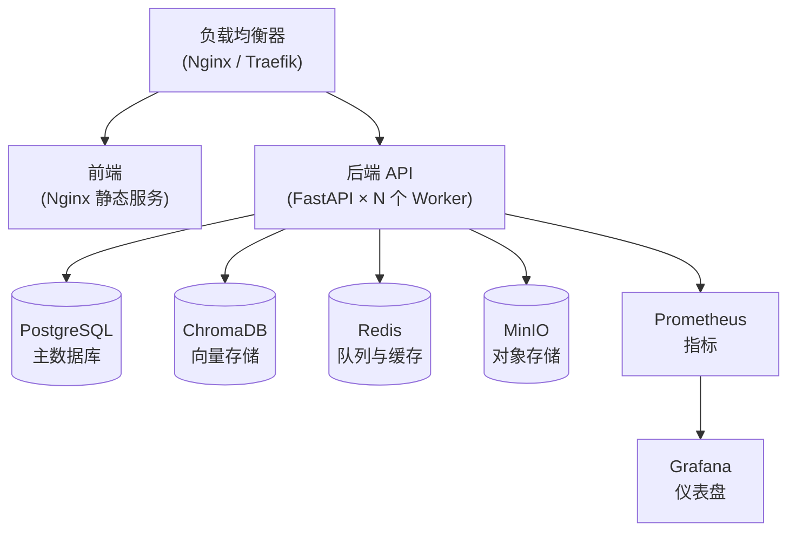
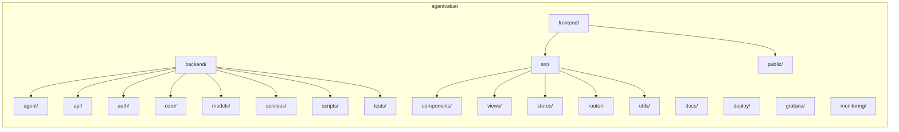

<p align="center">
  
</p>

<h1 align="center">AgentValue</h1>

<p align="center">
  <strong>AI 驱动的员工价值量化与成长平台</strong><br/>
  对话式 AI · 智能体工具 · 自动化绩效评估 · 三维评估系统
</p>

<p align="center">
  <a href="LICENSE"></a>
  
  
  
  
  
  
  <a href="CHANGELOG.md"></a>
  <a href="https://gitcode.com/badhope/agentvalue/issues"></a>
</p>

<p align="center">
  <a href="#-功能特性">功能特性</a> •
  <a href="#-系统架构">系统架构</a> •
  <a href="#-快速开始">快速开始</a> •
  <a href="#-配置说明">配置说明</a> •
  <a href="#-使用指南">使用指南</a> •
  <a href="#-部署">部署</a> •
  <a href="#-多语言">🌐 中文</a> •
  <a href="#-多语言">🇯🇵 日本語</a>
</p>

---

## ✨ 功能特性

### 🤖 AI 聊天

| 功能 | 描述 |
|---|---|
| **流式响应** | SSE 逐 Token 输出，支持中止 |
| **工具调用展示** | 可折叠 I/O、JSON 格式化美化、状态图标 |
| **思考过程** | 可折叠的 `reasoning_content`（DeepSeek / Gemini / Claude） |
| **消息操作** | 复制代码块/整条消息、编辑用户消息、重新生成 |
| **会话管理** | 自动标题、重命名、搜索、Markdown 导出 |
| **数学公式渲染** | KaTeX 行内 `$...$` 和块级 `$$...$$` |
| **图表渲染** | Mermaid 流程图和时序图，懒加载 |
| **文件上传** | 多文件附件，10 MB 限制 |
| **模型切换** | 通过下拉菜单支持 8+ 种模型 |
| **反馈** | 点赞/点踩，持久化保存 |

### 🛠 智能体工具系统

| 工具 | 描述 | 安全机制 |
|---|---|---|
| `bash` | 执行 Shell 命令 | 30 秒超时，5000 字符截断 |
| `read_file` | 读取文件内容 | 5000 字符截断 |
| `write_file` | 写入文件 | 自动创建父目录 |
| `list_directory` | 列出目录内容 | — |
| `web_fetch` | 获取并解析网页 | HTML 转文本，截断 |
| `calculator` | 算术与数学表达式 | — |
| `get_current_datetime` | 当前日期/时间 | — |
| `get_employee_history` | 查询历史评估记录 | 业务工具 |
| `query_company_kb` | 查询企业知识库 | 业务工具 |

所有工具通过 `ToolRegistry` 统一管理。可通过 `enabled_tools` 按环境启用/禁用。

### 📊 员工价值评估

核心差异化能力——多视角 AI 评估系统：

| 视角 | 受众 | 目的 |
|---|---|---|
| **员工视角** | 员工本人 | 建设性的成长反馈、优势与改进方向 |
| **管理者视角** | 经理 / HR | 人才诊断、ROI 分析、团队构成建议 |
| **审计视角** | 合规 / 审计 | 每个结论关联原始证据，完全可追溯 |

所有评估结果须经**人工审批**后方可生效。AI 生成结构化评估报告——人类做出最终决策。

### 👥 基于角色的仪表盘

| 门户 | 路由 | 角色 | 核心功能 |
|---|---|---|---|
| 员工 | `/employee` | `employee` | 成长仪表盘、雷达图、日报录入、历史记录、反馈、成长路径 |
| 管理者 | `/manager` | `manager`, `admin` | 团队价值排名、风险分析、待审批项、ROI 九宫格 |
| HR | `/hr` | `hr`, `admin` | 审核队列、审计详情、申诉记录、投诉跟踪 |
| 管理员 | `/admin` | `admin` | 模型管理、LLM 配置、供应商配置、提示词工具、审计日志、安全、计费 |

### ⚙️ 管理控制台（40+ 管理页面）

| 类别 | 页面 |
|---|---|
| **模型与 LLM** | 模型管理、LLM 配置、模型供应商、提示词试验场、提示词管理、模型降级 |
| **智能体与工具** | 智能体预设、技能、自定义工具、工作流编排、多智能体 |
| **可观测性** | 链路追踪、Token 指标、API 健康、审计日志、调试追踪 |
| **评估** | 人才矩阵、LLM 评审、RAG 评估、人工标注、数据集管理 |
| **安全与合规** | 安全治理、敏感词、SSO 配置、配额与预算、计费 |
| **内容与知识** | 知识库、文档解析、NL2SQL、混合搜索 |
| **运维** | 功能开关、告警管理、定时任务、发布运维、模型运维 |

> 标注 `*` 的页面已具备后端 API 和数据模型；管理 UI 仍在建设中。其余路由均具备完整的前端页面。

---

## 🏗 系统架构



### 技术栈

| 层 | 技术 |
|---|---|
| **前端** | Vue 3 (JavaScript) · Vite · Element Plus · ECharts · Vue Flow · KaTeX · Mermaid |
| **后端** | Python 3.11+ · FastAPI · SQLAlchemy · Alembic |
| **智能体框架** | LangGraph（监督者多智能体 + ReAct 循环 + SSE 流式传输） |
| **LLM 供应商** | OpenAI / Anthropic Claude / Google Gemini / DeepSeek / Qwen / Ollama（加密凭据 + 负载均衡） |
| **重排序器** | Cohere / Jina / BGE（本地）/ Dummy 降级 |
| **流式传输** | sse-starlette + @microsoft/fetch-event-source |
| **向量记忆** | ChromaDB |
| **数据库** | SQLite（默认）/ PostgreSQL（生产环境） |
| **缓存 / 队列** | Redis（未配置时使用内存降级） |
| **可观测性** | Prometheus + Langfuse + Grafana + Loki |
| **工作流引擎** | 自定义 DAG 执行器（Kahn 拓扑排序、7 种节点类型、代码沙箱） |
| **功能开关** | 自定义 5 层规则引擎（sha256 一致性哈希、60 秒 LRU 缓存） |
| **测试** | pytest（后端）+ Vitest（前端）+ Playwright（E2E）+ Locust（性能） |
| **部署** | Docker Compose（开发 + 生产）· 提供 Kubernetes 清单 |
| **安全** | InputGuard + OutputGuard（PII 脱敏、越狱检测、偏见检测、幻觉标记） |

---

## 🚀 快速开始

### 前置条件

| 依赖 | 版本 | 用途 |
|---|---|---|
| Python | 3.11+ | 后端运行环境 |
| Node.js | 20+ | 前端开发服务器与构建 |
| Docker & Compose | 24+ / 2.24+ | 容器化部署（推荐） |
| Git | 2.30+ | 源码管理 |
| Make | — | 辅助命令（可选） |

### 方式一：Docker Compose（推荐）

```bash
# 克隆仓库
git clone https://gitcode.com/badhope/agentvalue.git
cd agentvalue

# 复制环境配置
cp backend/.env.example backend/.env

# 编辑 .env — 至少设置 JWT_SECRET_KEY 和 CLOUD_API_KEY
# 详见配置说明

# 启动所有服务
docker compose up -d --build
```

启动后，可访问以下地址：

| 服务 | 地址 |
|---|---|
| 前端 | http://localhost |
| 后端 API | http://localhost:8000 |
| 健康检查 | http://localhost:8000/health |
| Swagger UI | http://localhost:8000/docs |
| Grafana | http://localhost:3000（仅生产环境） |

### 方式二：本地开发

**后端：**

```bash
cd backend
python -m venv .venv && source .venv/bin/activate  # Windows 使用 .venv\Scripts\activate
pip install -r requirements.txt
cp .env.example .env
# 编辑 .env — 填写你的 API Key
uvicorn main:app --reload --port 8000
```

**前端：**

```bash
cd frontend
npm install
npm run dev
# 打开 http://localhost:5173
```

Vite 开发服务器会自动将 `/api/*` 请求代理到 `http://localhost:8000`。

### 方式三：无需 API Key 运行（Mock 模式）

```bash
cd backend
cp .env.example .env
uvicorn main:app --reload --port 8000
# 当未配置 LLM API Key 时，系统自动选择 Mock Provider

# 运行模拟评估（端到端，无外部依赖）
python -m eval.evaluate --mock
```

> **重要：** 演示模式（`AUTH_DEMO_MODE=true`）允许通过传递 role 头信息绕过 JWT 认证。仅限本地开发使用——**切勿在生产环境中启用**。

---

## ⚙️ 配置说明

配置通过环境变量（`.env` 文件）管理。复制 `backend/.env.example` 到 `backend/.env` 并自定义。

### 必要配置

| 变量 | 默认值 | 描述 | 用途场景 |
|---|---|---|---|
| `JWT_SECRET_KEY` | `change-me` | JWT 签名密钥——**生产环境必须修改** | 生产环境 |
| `AGENTVALUE_ENV` | `development` | 设置为 `production` 以启用生产环境安全防护 | 生产环境 |
| `CLOUD_API_KEY` | — | 云端 LLM 的 API Key（OpenAI 兼容接口） | 使用云端 LLM |
| `DATABASE_URL` | `sqlite+aiosqlite:///./agentvalue.db` | 数据库连接字符串 | 任意环境 |
| `CORS_ORIGINS` | `http://localhost:5173` | 允许的 CORS 来源 | 生产环境（设置为实际域名） |
| `FIELD_ENCRYPTION_KEY` | — | AES-GCM 密钥，用于加密数据库敏感字段 | 生产环境 |

### LLM 供应商配置

| 变量 | 默认值 | 描述 |
|---|---|---|
| `CLOUD_API_KEY` | — | 主云端 LLM API Key（OpenAI 兼容） |
| `CLOUD_BASE_URL` | `https://api.openai.com/v1` | 云端 LLM 接口地址 |
| `CLOUD_MODEL` | `gpt-4o-mini` | 默认云端模型 |
| `OPENAI_API_KEY` | — | 旧版降级（`CLOUD_*` 未设置时使用） |
| `LOCAL_BASE_URL` | `http://localhost:1234/v1` | 本地 LLM 接口地址（Ollama / LM Studio） |
| `LOCAL_MODEL_L1` | `qwen2.5-0.5b` | 边缘级本地模型 |
| `LOCAL_MODEL_L2` | `qwen2.5-7b` | 标准本地模型 |
| `LOCAL_MODEL_L3` | `qwen2.5-14b` | 旗舰级本地模型 |

### 模型层级

| 层级 | 用途 | 示例 |
|---|---|---|
| `auto` | 根据硬件自动检测（默认） | — |
| `L0` | 云端旗舰 | GPT-4o, DeepSeek-V3, Qwen-Max |
| `L1` | 边缘/小型本地 | Qwen2.5-0.5B |
| `L2` | 标准本地 | Qwen2.5-7B |
| `L3` | 本地旗舰 | Qwen2.5-14B |

当 `CLOUD_API_KEY` 和 `LOCAL_BASE_URL` 均未配置时，系统将降级为 **Mock Provider**——所有 LLM 调用返回确定性的模拟响应，使整个评估流程能够在测试环境下端到端运行。

### 嵌入与向量存储

| 变量 | 默认值 | 描述 |
|---|---|---|
| `EMBEDDING_API_KEY` | — | 嵌入服务 API Key |
| `EMBEDDING_BASE_URL` | `https://api.openai.com/v1` | 嵌入接口地址 |
| `EMBEDDING_MODEL` | `text-embedding-3-small` | 嵌入模型 |
| `EMBEDDING_DIMENSIONS` | `1536` | 必须与模型匹配（云端 1536，BGE 1024） |
| `VECTOR_STORE_DIR` | `./chroma_db` | 向量数据库存储路径 |

> **重要：** 从 Mock 切换到真实嵌入模型后，必须重建向量存储：`python -m scripts.seed_kb --clear`。

### 安全配置

| 变量 | 默认值 | 描述 |
|---|---|---|
| `JWT_SECRET_KEY` | `change-me` | JWT 签名密钥（至少 32 字符） |
| `JWT_ALGORITHM` | `HS256` | 签名算法 |
| `JWT_EXPIRE_MINUTES` | `1440` | Token 过期时间（24 小时） |
| `FIELD_ENCRYPTION_KEY` | — | AES-GCM 字段加密的 32 字符十六进制密钥 |
| `CORS_ORIGINS` | `http://localhost:5173` | 逗号分隔的允许来源列表 |
| `INPUTGUARD_ENABLED` | `true` | 启用输入内容安全防护 |
| `OUTPUTGUARD_ENABLED` | `true` | 启用输出内容安全防护 |

### 可观测性

| 变量 | 默认值 | 描述 |
|---|---|---|
| `LANGFUSE_PUBLIC_KEY` | — | Langfuse 链路追踪公钥 |
| `LANGFUSE_SECRET_KEY` | — | Langfuse 链路追踪私钥 |
| `LANGFUSE_HOST` | — | Langfuse 自托管 URL |
| `PROMETHEUS_MULTIPROC_DIR` | — | Prometheus 多进程临时目录 |

> 完整的 `backend/.env.example` 文件包含所有可配置变量及行内注释，可[在此查看](backend/.env.example)。

---

## 📖 使用指南

### 1. 初始化种子数据

```bash
# 初始化知识库（评分标准、企业价值观、培训材料）
python -m scripts.seed_kb

# 初始化演示用户及示例评估
python -m scripts.seed_demo
```

### 2. 登录

四种内置角色：

```bash
# 注册新用户
curl -X POST http://localhost:8000/api/v1/auth/register \
  -H "Content-Type: application/json" \
  -d '{"email": "user@company.com", "password": "securepass", "name": "User Name", "role": "employee"}'

# 登录
curl -X POST http://localhost:8000/api/v1/auth/login \
  -H "Content-Type: application/json" \
  -d '{"email": "user@company.com", "password": "securepass"}'
# 返回：{"access_token": "eyJ...", "token_type": "bearer", "user_id": "...", "name": "...", "role": "employee"}
```

在**演示模式**下（仅限本地开发），登录页面提供一键式演示账号按钮。

### 3. 执行评估

```bash
curl -X POST http://localhost:8000/api/v1/evaluations \
  -H "Authorization: Bearer <admin-token>" \
  -H "Content-Type: application/json" \
  -d '{
    "employee_id": "E1001",
    "period": "2026-W25",
    "raw_inputs": [
      {"type": "daily_report", "content": "完成了订单中心 API 重构..."},
      {"type": "task_progress", "content": "JIRA-2051：集成测试阶段..."},
      {"type": "code_contributions", "content": "PR #342 已合并：15 个文件，+342/-89 行"}
    ]
  }'
```

评估流程通过 LangGraph 状态机流转：



### 4. 查看评估结果（三维评估系统）

```bash
curl http://localhost:8000/api/v1/evaluations/{id} \
  -H "Authorization: Bearer <token>"
```

响应中包含三个并行视图，每个视图针对其受众量身定制：

- `employee_view`（员工视图）：面向成长的反馈、优势、建议行动
- `manager_view`（管理者视图）：ROI 分析、风险标记、团队构成洞察
- `audit_view`（审计视图）：每个结论附带来源证据引用

**字段级可见性由 RBAC 强制执行**——员工 Token 无法访问 `manager_view` 或 `audit_view`。

### 5. AI 聊天

在浏览器中导航至 `/admin/chat`，或使用 API：

```bash
# 创建聊天会话
curl -X POST http://localhost:8000/api/v1/chat/sessions \
  -H "Authorization: Bearer <token>" \
  -H "Content-Type: application/json" \
  -d '{"title": "研讨会话", "model_name": "DeepSeek-V4-Flash"}'

# 发送消息（SSE 流式响应）
curl -X POST http://localhost:8000/api/v1/chat/sessions/{id}/messages \
  -H "Authorization: Bearer <token>" \
  -H "Content-Type: application/json" \
  -d '{"content": "列出当前目录中的文件"}'

# 列出会话
curl http://localhost:8000/api/v1/chat/sessions \
  -H "Authorization: Bearer <token>"

# 将会话导出为 Markdown
curl http://localhost:8000/api/v1/chat/sessions/{id}/export \
  -H "Authorization: Bearer <token>" \
  -o session.md
```

### 6. 可观测性

| 功能 | 地址 / 接口 | 描述 |
|---|---|---|
| Prometheus 指标 | http://localhost:8000/metrics | 21+ 项业务指标 |
| Grafana 仪表盘 | http://localhost:3000（生产环境） | 可视化指标与告警 |
| Langfuse 链路追踪 | 配置 `LANGFUSE_*` | 完整的 LLM 追踪查看器 |
| 审计日志 | `/admin/audit-logs` | 所有写操作，分页查看 |
| 健康检查 | http://localhost:8000/health | 服务就绪状态 |

---

## 🧪 测试

```bash
# 后端单元测试（1517+ 个测试）
cd backend && python -m pytest tests -q

# 后端 E2E 测试
cd backend && python -m pytest -m e2e -q

# 后端模拟评估（无外部依赖）
cd backend && python -m eval.evaluate --mock

# 后端企业测试（122 个测试）
cd backend && python -m pytest tests/enterprise/ -q

# 前端测试
cd frontend && npm run lint          # ESLint
cd frontend && npx vitest run        # Vitest（47+ 个测试）
cd frontend && npm run build         # 构建检查

# 负载测试
cd backend && locust -f tests/perf/locustfile.py --headless -u 100 -r 10
```

---

## 📦 部署

### Docker Compose（开发环境）

```bash
docker compose up -d --build
```

### Docker Compose（生产环境）

```bash
cp backend/.env.example backend/.env
# 编辑 .env — 设置所有生产环境凭据

# 运行生产就绪检查
cd backend && python scripts/check_prod_readiness.py

# 启动生产环境堆栈（增加 PostgreSQL、MinIO、Prometheus + Grafana）
docker compose -f docker-compose.yml -f docker-compose.prod.yml up -d --build
```

### 生产环境架构



### 部署检查清单

- [ ] 生成强 `JWT_SECRET_KEY`（至少 32 个随机字符）
- [ ] 生成 `FIELD_ENCRYPTION_KEY`（通过 `openssl rand -hex 32` 生成 64 位十六进制字符）
- [ ] 设置 `AGENTVUE_ENV=production`
- [ ] 将 `CORS_ORIGINS` 设置为实际前端域名
- [ ] 将 `DATABASE_URL` 切换为 PostgreSQL
- [ ] 配置 `REDIS_URL` 用于任务队列
- [ ] 设置 HTTPS（反向代理处配置 TLS 终止）
- [ ] 禁用演示认证：在 `frontend/src/utils/auth.js` 中确保 `isDemoAuthEnabled()` 返回 `false`
- [ ] 配置 `CLOUD_API_KEY` 或设置本地 LLM 接口地址
- [ ] 运行 `python scripts/check_prod_readiness.py` 并修复所有警告
- [ ] 配置监控告警（参见 `docs/alerting-rules.md`）

### 详细部署指南

| 指南 | 描述 |
|---|---|
| [部署指南](docs/deployment-guide.md) | 完整生产环境部署步骤 |
| [试点运行手册](docs/pilot-runbook.md) | 分步试点部署与验证 |
| [规模化部署](docs/scale-deployment-runbook.md) | 扩展、高可用、多区域 |
| [Kubernetes 清单](deploy/k8s/) | K8s 部署 YAML 文件 |

---

## 📂 项目结构



| 路径 | 描述 |
|---|---|
| `backend/` | FastAPI Python 后端 |
| `backend/agent/` | LangGraph 状态机、ReAct 循环、工具定义 |
| `backend/api/` | REST API 路由（聊天、认证、管理、评估） |
| `backend/auth/` | JWT 认证与 RBAC 权限控制 |
| `backend/core/` | 配置、模型路由、安全防护、工作流引擎、功能开关 |
| `backend/models/` | SQLAlchemy ORM 模型 |
| `backend/services/` | 业务逻辑服务 |
| `backend/scripts/` | 数据初始化、迁移、生产就绪检查 |
| `backend/tests/` | 1500+ 个单元测试、集成测试和 E2E 测试 |
| `frontend/` | Vue 3 前端应用 |
| `frontend/src/views/` | 基于角色的页面视图（员工、管理者、HR、管理员、移动端） |
| `frontend/src/components/` | 可复用的 Vue 组件（聊天、评估、布局） |
| `frontend/src/stores/` | Pinia 状态管理模块 |
| `frontend/src/router/` | Vue Router 配置，含基于角色的路由守卫 |
| `docs/` | 架构文档、部署指南、ADR 记录 |
| `deploy/k8s/` | Kubernetes 部署清单 |
| `monitoring/` | Prometheus 告警规则与配置 |

---

## 🔒 企业级安全与合规

### 安全层级

| 层级 | 实现方式 |
|---|---|
| **认证** | JWT（HS256/RS256），带过期时间和受众验证 |
| **授权** | RBAC，字段级数据可见性控制 |
| **输入防护** | PII 脱敏、提示注入检测、越狱检测 |
| **输出防护** | 偏见检测、幻觉标记、敏感内容过滤 |
| **数据加密** | AES-256-GCM 字段级加密，保护敏感列 |
| **工具安全** | 30 秒超时、输出截断、按工具启用/禁用 |
| **审计追踪** | 所有写操作均记入日志（谁、做了什么、何时、旧值/新值） |
| **速率限制** | API 网关层面按用户和按 IP 进行速率限制 |

### 合规检查清单

- **数据隐私**：符合 GDPR 标准的审计追踪、数据留存策略、被遗忘权
- **公平性**：评估输出中的偏见检测、公平性审计脚本
- **人工监督**：硬性约束——AI 生成评估报告，人类做出决策
- **证据可追溯性**：每条评估结论均链接到源证据
- **访问控制**：基于角色的仪表盘、字段级 API 可见性
- **默认安全**：生产模式下默认启用所有安全防护

> 安全开发指南请参见 `docs/dev-guidelines.md`。

---

## 🌐 多语言

- **English**: [README.md](README.md)
- **简体中文**: [README.zh-CN.md](README.zh-CN.md)（本文档）
- **日本語**: [README.ja-JP.md](README.ja-JP.md)

应用程序 UI 当前支持中文（默认）。英文和日文的国际化（i18n）支持已在路线图中。

---

## ❓ 常见问题

**能否在没有 API Key 的情况下运行？**

可以。当未配置 LLM API Key 时，系统使用 Mock Provider——所有 LLM 调用返回确定性的模拟响应。整个评估管线可端到端运行。如需实际使用，请配置 `CLOUD_API_KEY` 或 `LOCAL_BASE_URL`。

**评估结果能否用于 HR 决策？**

**不能。** "AI 不做人事决策" 是一条硬性约束。所有评估结果必须经过管理者审批。高风险项目还需额外经过 HR 审核。AI 生成结构化评估报告——人类制定并执行决策。

**bash 工具安全吗？**

该工具设置了 30 秒超时和 5000 字符输出截断。所有工具通过 `ToolRegistry` 统一管理，可通过 `enabled_tools` 单独启用/禁用。在生产环境中，你可以只允许 `calculator` 和 `get_current_datetime` 两个工具。

**支持哪些模型？**

系统支持任何兼容 OpenAI 接口且支持函数调用的 API。预配置模型包括：DeepSeek V4 Flash/Pro、GLM 4.7/5.1、Qwen 3 Coder、Kimi K2.6、MiniMax M3、GPT-4o、Claude Sonnet、Gemini 2.0。

**多租户如何处理？**

每个数据库表包含 `tenant_id` 字段。RBAC 强制执行数据级过滤。ChromaDB 集合按租户隔离。任务队列前缀包含租户 ID。

**能否进行本地部署？**

可以。整个平台自包含，可通过 Docker Compose 或 Kubernetes 部署。核心功能无需外部 SaaS 依赖（LLM 供应商为可选插件）。

---

## 🤝 贡献指南

欢迎贡献！在提交 Issue 或 PR 之前，请阅读 [CONTRIBUTING.md](CONTRIBUTING.md)。

- **问题跟踪**：[GitCode Issues](https://gitcode.com/badhope/agentvalue/issues)
- **PR 工作流**：CI（代码检查 + 测试 + 构建）必须在合并前全部通过

---

## 🐛 安全

请通过 [SECURITY.md](SECURITY.md) 私下报告安全漏洞——**不要**公开提交 Issue。

---

## 📚 文档索引

| 文档 | 描述 |
|---|---|
| [CHANGELOG.md](CHANGELOG.md) | 完整版本历史与发布日志 |
| [CONTRIBUTING.md](CONTRIBUTING.md) | 贡献指南 |
| [SECURITY.md](SECURITY.md) | 安全漏洞报告 |
| [CODE_OF_CONDUCT.md](CODE_OF_CONDUCT.md) | 社区行为准则 |
| [backend/README.md](backend/README.md) | 后端开发指南 |
| [frontend/README.md](frontend/README.md) | 前端开发指南 |
| [docs/architecture-notes.md](docs/architecture-notes.md) | 架构实现细节 |
| [docs/deployment-guide.md](docs/deployment-guide.md) | 企业部署手册 |
| [docs/dev-guidelines.md](docs/dev-guidelines.md) | 开发标准与模式 |
| [docs/DEVELOPMENT-PLAN.md](docs/DEVELOPMENT-PLAN.md) | 开发路线图与规划 |
| [docs/DEVELOPER_CHECKLIST.md](docs/DEVELOPER_CHECKLIST.md) | 开发者入职检查清单 |
| [docs/pilot-runbook.md](docs/pilot-runbook.md) | 试点部署运行手册 |
| [docs/scale-deployment-runbook.md](docs/scale-deployment-runbook.md) | 规模化部署与高可用指南 |
| [docs/alerting-rules.md](docs/alerting-rules.md) | 生产环境告警规则 |
| [backend/.env.example](backend/.env.example) | 完整环境变量参考 |

---

## 📜 许可证

本项目采用 **Custom Non-Commercial License (CNCL) v1.0** 许可。详见 [LICENSE](LICENSE)。© 2026 AgentValue 贡献者。

---

### 镜像仓库

| 平台 | 地址 | 用途 |
|---|---|---|
| GitCode（主仓库） | https://gitcode.com/badhope/agentvalue | Issues 与 PRs |
| GitHub（镜像） | https://github.com/weed33834/agentvalue | 国际镜像 |
